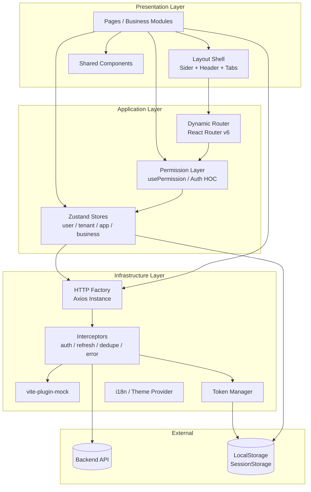
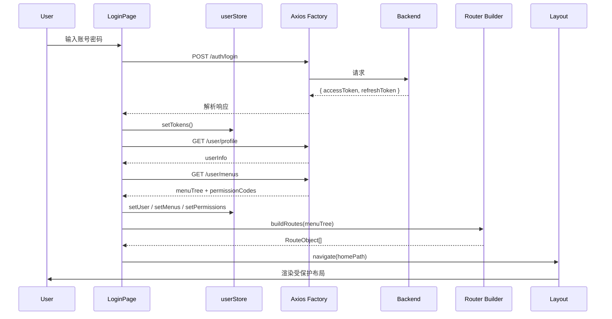
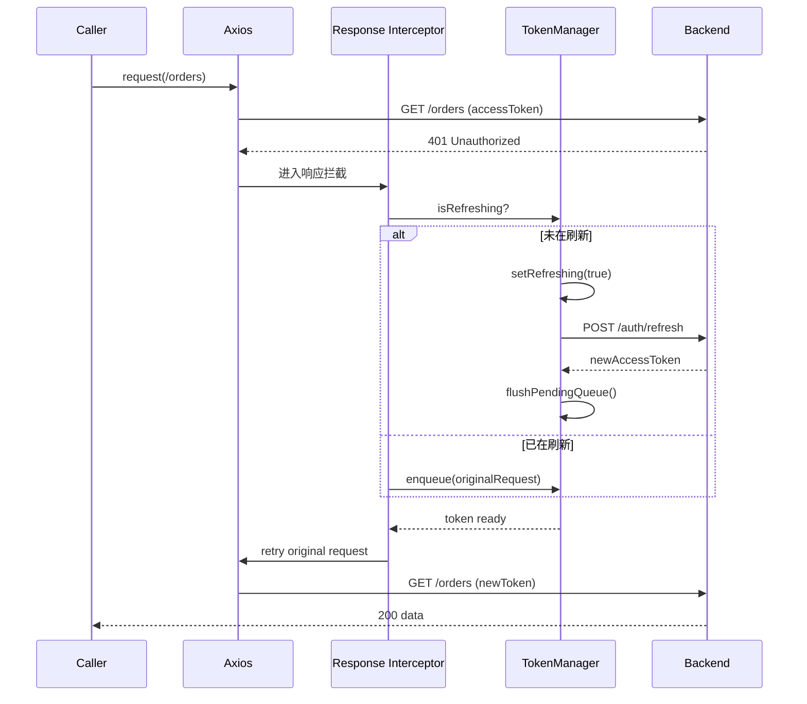
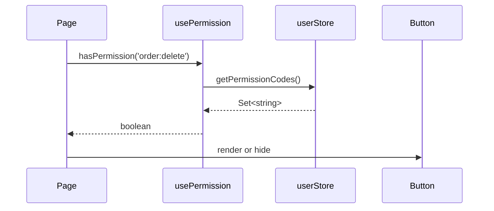
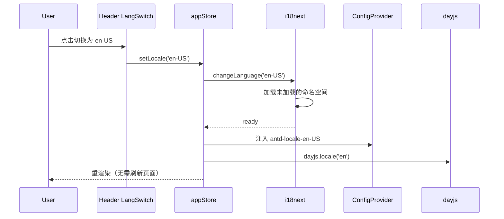

# Design Document: SaaS Admin Template

## Overview

`keel-admin`（`saas-admin-template`）是一套面向企业级 SaaS 中后台业务的 React 前端模板工程。它以 Vite + React 18 + TypeScript 为基础脚手架，以 Ant Design 5 与 `@ant-design/pro-components` 作为视觉与组件底座，通过 ConfigProvider Design Token 把默认 AntD 视觉重塑为"类 iOS"风格——大圆角、毛玻璃半透明卡片、低饱和度配色、轻量阴影、SF/Inter 字体栈，并通过 vite-plugin-mock 提供前后端解耦的本地开发能力。

工程仓库采用 **pnpm workspaces + Turborepo 的 Monorepo 结构**，业务主应用与基础能力包（HTTP 工厂、权限层、UI 组件、主题、i18n、共享类型）解耦发布，方便后续扩展第二、第三个 SaaS 子产品时直接复用。CI/CD 由 GitHub Actions 驱动，构建产物通过多阶段 Dockerfile 打包到 Nginx 镜像，支持多环境（dev / staging / production）切换。

工程从一开始就把"鉴权、权限、网络、状态、布局、Mock、测试、规范、国际化、主题、部署"这十一条横切关注点固化为开箱即用的基础设施：动态路由由后端菜单树驱动、按钮级权限通过 `usePermission` Hook 与 `<Auth />` HOC 双形态暴露、Axios 请求工厂内建无感刷新 Token、防重复提交、业务错误码统一拦截，状态层基于 Zustand 按业务域切片，国际化基于 react-i18next 支持懒加载语言包，最后用 Playwright 在 CI 里跑核心 CRUD 与登录冒烟。

设计目标是：让上层业务团队 fork 仓库后，专注写"页面 + 业务 store + 业务 API"三件事，剩下的工程问题模板都已经替它解决。

## Architecture

### 整体分层架构



### 关键运行时数据流

#### 流程 A：登录 → 加载用户与菜单 → 动态生成路由



#### 流程 B：业务请求遇到 401 → 无感刷新 Token



#### 流程 C：按钮级权限校验



### 模块划分

#### Monorepo 顶层视图

| 工作区 | 角色 | 说明 |
|--------|------|------|
| `apps/admin` | 业务主应用 | 装配 Provider、动态路由、页面、业务 store |
| `packages/http` | HTTP 工厂 | Axios 实例、拦截器、Token、防重复提交 |
| `packages/auth` | 权限层 | 菜单 → 路由、`usePermission`、`<Auth />` |
| `packages/ui` | 业务组件库 | PageContainer、SearchForm、ProTable 封装 |
| `packages/theme` | 主题包 | AntD Token、CSS 变量、类 iOS 风格 |
| `packages/i18n` | 国际化 | i18n 工厂、公共词条、`useT` Hook |
| `packages/utils` | 通用工具 | storage、logger、date、event-bus |
| `packages/types` | 共享类型 | `ApiEnvelope`、`UserInfo`、`MenuNode` |
| `packages/eslint-config` | 规范配置 | 统一的 ESLint / Prettier / TS 配置 |
| `tooling/vite-plugins` | 自研 Vite 插件 | env 校验、build-info 注入 |

#### 主应用内部模块

| 模块 | 职责 | 关键依赖 |
|------|------|---------|
| `app/` | 应用根组件、Provider 装配、全局错误边界 | React, AntD ConfigProvider |
| `router/` | 动态路由表构建、路由守卫、懒加载 | React Router v6, `@keel/auth` |
| `layout/` | Sider 菜单、Header、面包屑、多页签、外壳 | `@ant-design/pro-components` 思想自实现 |
| `pages/` | 业务页面（登录、Dashboard、CRUD 示例、403/404） | - |
| `components/` | 业务专属组件（薄壳，重逻辑沉淀到 `@keel/ui`） | `@keel/ui` |
| `hooks/` | usePermission（re-export）、useRequest、useTable、useTenant | `@keel/auth` |
| `stores/` | Zustand 切片：userStore, tenantStore, appStore, 业务 store | Zustand |
| `services/` | API 函数集合，按业务域分文件 | `@keel/http` |
| `mock/` | 本地 Mock 数据与处理器 | vite-plugin-mock |
| `config/` | 环境变量解析、常量、静态路由 | `@keel/theme` |
| `locales/` | 业务模块语言资源 | `@keel/i18n` |
| `tests/` | Vitest 单测 + Playwright E2E | Vitest, Playwright |

### 目录结构（Monorepo）

仓库采用 pnpm workspaces + Turborepo，根目录为编排层，所有应用放在 `apps/`，可复用能力沉淀到 `packages/`。

```
keel-admin/                        # 仓库根（pnpm workspace 根）
├── .github/
│   └── workflows/
│       ├── ci.yml                 # lint + test + build
│       ├── e2e.yml                # Playwright
│       └── release.yml            # 构建并推送 Docker 镜像
├── .husky/
├── .vscode/
├── docker/
│   ├── Dockerfile                 # 多阶段：node 构建 + nginx 运行
│   ├── nginx.conf                 # SPA fallback / gzip / 安全头
│   └── docker-compose.yml         # 本地一键起 admin + mock-api
├── apps/
│   └── admin/                     # 主应用
│       ├── mock/
│       │   ├── _utils.ts
│       │   ├── auth.ts
│       │   ├── menu.ts
│       │   ├── user.ts
│       │   └── order.ts
│       ├── public/
│       ├── src/
│       │   ├── app/
│       │   │   ├── App.tsx
│       │   │   ├── providers.tsx  # ConfigProvider / AntdApp / I18n / ErrorBoundary
│       │   │   └── bootstrap.ts
│       │   ├── assets/
│       │   ├── components/
│       │   │   ├── Auth/
│       │   │   ├── PageContainer/
│       │   │   ├── SearchForm/
│       │   │   ├── ProTable/      # 基于 @ant-design/pro-components 的封装
│       │   │   └── Icon/
│       │   ├── config/
│       │   │   ├── env.ts
│       │   │   ├── routes.static.ts
│       │   │   └── constants.ts
│       │   ├── hooks/
│       │   ├── layout/
│       │   ├── pages/
│       │   ├── router/
│       │   ├── services/
│       │   ├── stores/
│       │   ├── styles/
│       │   ├── locales/           # 仅放业务语言资源（公共词条在 packages/i18n）
│       │   │   ├── zh-CN/
│       │   │   └── en-US/
│       │   ├── types/
│       │   ├── main.tsx
│       │   └── vite-env.d.ts
│       ├── tests/
│       │   ├── unit/
│       │   └── e2e/
│       ├── .env
│       ├── .env.development
│       ├── .env.staging
│       ├── .env.production
│       ├── index.html
│       ├── playwright.config.ts
│       ├── tsconfig.json
│       ├── vite.config.ts
│       └── package.json
├── packages/
│   ├── http/                      # Axios 工厂、拦截器、Token 管理、防重复提交
│   ├── auth/                      # 权限码解析、菜单 → 路由、usePermission、Auth HOC
│   ├── ui/                        # 跨产品复用的业务组件（PageContainer、SearchForm 等）
│   ├── theme/                     # AntD Token、CSS 变量、类 iOS 主题包
│   ├── i18n/                      # i18n 工厂、公共词条、语言切换 hooks
│   ├── utils/                     # 通用工具（storage、logger、date）
│   ├── types/                     # 跨包共享类型（ApiEnvelope、UserInfo、MenuNode）
│   └── eslint-config/             # 统一的 ESLint / Prettier / TS 配置
├── tooling/
│   ├── vite-plugins/              # 自研 Vite 插件（如 build-info、env-validator）
│   └── scripts/                   # 维护脚本（gen-icon、bump-version）
├── .editorconfig
├── .eslintrc.cjs                  # 继承 packages/eslint-config
├── .prettierrc
├── .npmrc                         # pnpm 配置
├── commitlint.config.cjs
├── pnpm-workspace.yaml
├── turbo.json                     # Turborepo 任务编排
├── tsconfig.base.json
├── package.json                   # 根：脚本编排
└── README.md
```

**Workspace 依赖关系**：
- `apps/admin` 依赖 `@keel/http`、`@keel/auth`、`@keel/ui`、`@keel/theme`、`@keel/i18n`、`@keel/utils`、`@keel/types`
- 包之间最多一层依赖，禁止循环：`ui → theme`、`auth → types`、`http → types/utils`
- 通过 `tsconfig.base.json` 的 `paths` 实现 IDE 直跳源码，免构建联调

## Shared Packages（独立可发布的公共能力包）

设计原则：**任何在两个及以上业务项目中可能被复用的代码，都必须沉淀为 `packages/` 下的独立包**，并满足"可独立发布、可独立版本、可独立消费"。这样未来开第二个 SaaS 子产品时，无需 fork 模板，直接 `pnpm add @keel/http @keel/ui ...` 即可。

### 包边界与职责

| 包名 | 职责 | 关键导出 | peerDeps |
|------|------|---------|---------|
| `@keel/types` | 跨包共享的类型定义（无运行时代码） | `ApiEnvelope`、`UserInfo`、`MenuNode`、`Tenant` 等 | — |
| `@keel/utils` | 与框架无关的工具函数 | `storage`、`logger`、`eventBus`、`debounce`、`stableHash` | — |
| `@keel/http` | Axios 工厂、拦截器、Token、防重复提交、信封解开 | `createHttp`、`createTokenManager`、`BizError` | `axios` |
| `@keel/auth` | **权限机制**（generic）：`usePermission`、`<Auth />`、`buildRoutes`、`AuthGuard`、菜单→路由转换算法 | `usePermission`、`Auth`、`buildRoutes`、`AuthGuard` | `react`, `react-router-dom` |
| `@keel/i18n` | i18n 工厂、`useT`、语言切换 | `createI18n`、`I18nProvider`、`useT` | `react`, `i18next`, `react-i18next` |
| `@keel/theme` | 类 iOS 主题 token、CSS 变量、暗色映射 | `themeConfig`、`tokens`、`darkTokens` | `antd` |
| `@keel/ui` | 跨产品复用的业务组件（Pro-Components 薄封装、PageContainer、SearchForm、KeelTable） | 各组件命名导出 | `react`, `antd`, `@ant-design/pro-components`, `@keel/auth`, `@keel/i18n`, `@keel/theme` |
| `@keel/eslint-config` | 统一 ESLint / Prettier / TS 配置 | `index.js`、`react.js`、`node.js` | `eslint`, `prettier` |

### 关于 `@keel/auth` 的边界（机制 vs 数据）

权限是个容易踩坑的地方。这里把"机制"和"数据"严格拆开：

| 维度 | 归属 | 内容 |
|------|------|------|
| 权限**机制**（generic） | `packages/auth`（可复用） | `<Auth code/>`、`usePermission`、`buildRoutes`、`AuthGuard`、菜单 → 路由转换、`every / some` 语义、对 `Set<string>` 的判定 |
| 权限**数据**（business） | `apps/admin`（不可复用） | 具体权限码（`order:delete`、`tenant:switch`）、角色清单、权限码字典、菜单种子、权限码与 i18n 的映射 |
| 权限**载入** | `apps/admin` 的 `bootstrap` | 调 `/user/menus` `/user/permissions` 把数据写入 `userStore` |

也就是说：

- `@keel/auth` 不感知任何业务权限码，它只接收 `Set<string>` 和字符串入参，负责"判定 + 路由组装"这件事本身。
- 业务权限码、菜单语义、角色清单全部留在 `apps/admin/src/config/permissions.ts`、`apps/admin/src/services/menu.service.ts`，每个 SaaS 子产品各自定义、各自演进。
- 这样 `@keel/auth` 才能被多个业务项目共享；如果某个项目权限模型与众不同（比如 RBAC 之外还需 ABAC），可在业务侧实现一个 `Predicate` 适配器注入 `usePermission`。

#### 接口契约（机制层）

```ts
// @keel/auth/src/index.ts
export interface PermissionContext {
  /** 当前用户持有的权限码集合（来自业务 store） */
  permissions: Set<string>;
  /** 角色码集合（可选，给 hasRole 用） */
  roles?: Set<string>;
  /** 自定义判定器，用于 ABAC / 数据级权限等扩展 */
  predicate?: (code: string, ctx: PermissionContext) => boolean;
}

export interface AuthAdapter {
  /** 业务侧从自家 store 读取权限上下文（如 zustand selector） */
  useContext: () => PermissionContext;
}

export function createAuth(adapter: AuthAdapter): {
  usePermission: () => { has: (...) => boolean; hasRole: (r: string) => boolean };
  Auth: React.FC<AuthProps>;
  AuthGuard: React.FC<AuthGuardProps>;
  buildRoutes: (menus: MenuNode[], ctx: BuildRoutesContext) => RouteObject[];
};
```

#### 业务侧装配示例（apps/admin）

```ts
// apps/admin/src/auth.ts
import { createAuth } from '@keel/auth';
import { useUserStore } from '@/stores/user.store';

export const { usePermission, Auth, AuthGuard, buildRoutes } = createAuth({
  useContext: () => {
    const { permissions, roles } = useUserStore(s => ({
      permissions: s.permissions,
      roles: new Set(s.roles),
    }));
    return { permissions, roles };
  },
});
```

```ts
// apps/admin/src/config/permissions.ts
// ↑ 这里才是业务权限码的"真实归属"
export const PERMISSIONS = {
  ORDER: {
    LIST:   'order:list',
    CREATE: 'order:create',
    UPDATE: 'order:update',
    DELETE: 'order:delete',
    EXPORT: 'order:export',
  },
  TENANT: {
    SWITCH: 'tenant:switch',
  },
  // ...
} as const;
```

#### 数据流再确认

```mermaid
graph LR
    A[apps/admin: bootstrap] -->|GET /user/permissions| B[Backend]
    B --> A
    A -->|setPermissions| C[apps/admin: userStore]
    C -->|useContext adapter| D[@keel/auth]
    D -->|usePermission / Auth / buildRoutes| E[apps/admin: pages]
    F[apps/admin: PERMISSIONS 字典] -.code 字符串.-> E
```

权限码从业务字典里拿、从业务 store 里读，机制由共享包提供 —— 这样多项目复用与"每个应用权限不同"二者并不矛盾。

### 单包标准结构

每个包遵循同一套结构，便于工具链统一处理：

```
packages/<pkg>/
├── src/
│   ├── index.ts              # 唯一公共入口
│   └── ...
├── tests/
├── package.json
├── tsconfig.json             # extends ../../tsconfig.base.json
├── tsup.config.ts            # 构建配置（dual ESM+CJS+DTS）
├── README.md                 # 用法、API、Changelog 摘要
└── CHANGELOG.md              # 由 changesets 自动维护
```

### 标准 `package.json` 模板

```jsonc
{
  "name": "@keel/http",
  "version": "0.1.0",
  "description": "HTTP factory with token refresh, dedupe and envelope unwrap.",
  "type": "module",
  "sideEffects": false,
  "main": "./dist/index.cjs",
  "module": "./dist/index.js",
  "types": "./dist/index.d.ts",
  "exports": {
    ".": {
      "types": "./dist/index.d.ts",
      "import": "./dist/index.js",
      "require": "./dist/index.cjs"
    },
    "./package.json": "./package.json"
  },
  "files": ["dist", "README.md"],
  "publishConfig": {
    "access": "restricted",
    "registry": "https://npm.pkg.github.com"
  },
  "scripts": {
    "build": "tsup",
    "dev":   "tsup --watch",
    "lint":  "eslint src",
    "test":  "vitest run",
    "typecheck": "tsc --noEmit"
  },
  "peerDependencies": {
    "axios": "^1.7"
  },
  "dependencies": {
    "@keel/types": "workspace:*",
    "@keel/utils": "workspace:*"
  },
  "devDependencies": {
    "tsup": "^8",
    "vitest": "^1",
    "typescript": "^5.5",
    "@keel/eslint-config": "workspace:*"
  }
}
```

### 双形态产物（ESM + CJS + DTS）

每个包通过 `tsup` 同时产出三种形态，最大化消费兼容性：

```ts
// packages/http/tsup.config.ts
import { defineConfig } from 'tsup';
export default defineConfig({
  entry: ['src/index.ts'],
  format: ['esm', 'cjs'],
  dts: true,
  sourcemap: true,
  clean: true,
  splitting: false,
  treeshake: true,
  external: ['react', 'react-dom', 'axios', /^@keel\//],
});
```

### 包内消费 vs 包外消费

#### 仓库内（开发期）

通过 `tsconfig.base.json` 的 `paths` 直接指向源码，免 build 联调：

```json
{
  "compilerOptions": {
    "paths": {
      "@keel/http":  ["packages/http/src/index.ts"],
      "@keel/auth":  ["packages/auth/src/index.ts"],
      "@keel/ui":    ["packages/ui/src/index.ts"],
      "@keel/theme": ["packages/theme/src/index.ts"],
      "@keel/i18n":  ["packages/i18n/src/index.ts"],
      "@keel/utils": ["packages/utils/src/index.ts"],
      "@keel/types": ["packages/types/src/index.ts"]
    }
  }
}
```

主应用 `apps/admin/package.json` 通过 `workspace:*` 引用：

```jsonc
{
  "dependencies": {
    "@keel/http":  "workspace:*",
    "@keel/auth":  "workspace:*",
    "@keel/ui":    "workspace:*",
    "@keel/theme": "workspace:*",
    "@keel/i18n":  "workspace:*",
    "@keel/utils": "workspace:*",
    "@keel/types": "workspace:*"
  }
}
```

#### 仓库外（其他业务项目）

发布到私有 Registry（默认 GHCR / npm.pkg.github.com，可换成内部 Verdaccio）后，外部项目正常 `pnpm add`：

```bash
# 在另一个业务仓库
pnpm add @keel/http @keel/auth @keel/ui @keel/theme
```

外部消费方只需在 `.npmrc` 中配置 scope 指向：

```ini
@keel:registry=https://npm.pkg.github.com
//npm.pkg.github.com/:_authToken=${GH_PACKAGES_TOKEN}
```

### 版本治理（Changesets）

- 工具：`@changesets/cli`
- 流程：
  1. 提交 PR 时，开发者运行 `pnpm changeset` 描述变更范围与语义化级别（patch/minor/major）
  2. CI 校验 PR 必须包含 changeset 文件（业务专属变更可标记 `--empty`）
  3. 合并 main 后，"Version Packages" Bot PR 自动汇总 changelog 与版本号
  4. 合并 Bot PR 即触发 release workflow，自动 `pnpm publish -r --filter ./packages/*` 发布所有受影响的包
- 跨包语义化保证：受 changeset 涵盖的内部依赖会被 bump 一并触发上游升级
- 标签：每次 release 在 git 上打 `@keel/http@1.2.0` 形式的独立 tag

### 发布流水线（GitHub Actions）

```yaml
# .github/workflows/release.yml 片段
- uses: changesets/action@v1
  with:
    publish: pnpm release
    title: "chore: version packages"
    commit: "chore: version packages"
  env:
    GITHUB_TOKEN: ${{ secrets.GITHUB_TOKEN }}
    NPM_TOKEN: ${{ secrets.NPM_TOKEN }}
```

`pnpm release` 脚本：

```jsonc
// 根 package.json
{
  "scripts": {
    "release": "turbo run build --filter='./packages/*' && changeset publish"
  }
}
```

### 兼容性约束

- **peerDependencies 优先**：`react`、`antd`、`axios`、`react-router-dom` 等第三方一律走 peerDeps，避免重复打包与版本撕裂
- **不引入 CSS 副作用**：`@keel/ui` 不做 CSS 全局注入，主题靠 `@keel/theme` 的 ConfigProvider；`sideEffects: false` 保证 tree-shaking
- **导出规范**：所有包仅导出"经过设计"的命名导出，禁止 `export *`，避免 API 表面失控
- **类型即契约**：`@keel/types` 作为唯一的跨包类型来源，业务侧禁止重新声明 `ApiEnvelope` 等核心类型
- **版本基线**：所有 `@keel/*` 起步统一 `0.x`，达到生产就绪后整体升 `1.0`
- **API 弃用流程**：标记 `@deprecated` → 至少保留一个 minor → 下个 major 移除，并在 CHANGELOG 注明迁移指引

### 为新业务项目准备的脚手架命令（可选）

后续可在 `tooling/scripts/` 提供：

```bash
pnpm dlx @keel/create-app my-new-saas
# 内部会：
#   1. clone apps/admin 的最小子集
#   2. 写入 .npmrc 与 @keel/* 依赖
#   3. 替换 appName / theme / 默认 mock
```

## Pro-Components 组件策略

`@ant-design/pro-components` 提供了 ProLayout、ProTable、ProForm、ProDescriptions、ProCard、PageContainer 等高阶组件。我们的策略是**封装而非裸用**：在 `packages/ui` 内做一层薄壳，统一注入主题、国际化、权限与默认行为，业务侧只感知封装后的组件。

### 选型边界

| 直接使用（薄封装） | 自研但参考其设计 | 不使用 |
|--------------------|------------------|--------|
| `ProTable`、`ProForm`、`ProDescriptions`、`ProCard`、`PageContainer` | `BasicLayout`（Sider/Header/Tabs 自实现，因为多租户与多页签耦合较深） | `ProLayout`（默认风格强，与类 iOS 主题冲突） |

**理由**：
- ProTable/ProForm 抽象足够好，重写收益低；薄封装可注入「列权限过滤、统一分页、空态、错误重试」。
- ProLayout 视觉强耦合 AntD 默认风格，多页签/多租户切换扩展点不足，自研更可控。

### 封装示例

```ts
// packages/ui/src/ProTable/index.tsx
import { ProTable as AntProTable, type ProTableProps } from '@ant-design/pro-components';
import { useT } from '@keel/i18n';
import { usePermission } from '@keel/auth';

export interface KeelTableProps<T, P> extends ProTableProps<T, P> {
  /** 列上挂 permission 字段后，无权限的列会被过滤掉 */
  columns: (ProTableProps<T, P>['columns'][number] & { permission?: string })[];
}

export function KeelTable<T, P>(props: KeelTableProps<T, P>) {
  const t = useT();
  const { has } = usePermission();
  const columns = props.columns.filter(c => !c.permission || has(c.permission));

  return (
    <AntProTable<T, P>
      rowKey="id"
      cardBordered={false}
      search={{ labelWidth: 'auto', defaultCollapsed: false, ...props.search }}
      pagination={{ pageSize: 10, showSizeChanger: true, ...props.pagination }}
      options={{ density: false, fullScreen: true, reload: true, setting: true }}
      dateFormatter="string"
      ...其它默认值
      {...props}
      columns={columns}
      locale={/* 接入 @keel/i18n */}
    />
  );
}
```

### 主题嫁接

通过 `ConfigProvider` 把 pro-components 的 token 与 AntD token 同步，避免视觉割裂；并在 `packages/theme` 里维护 pro-components 专用 overrides（卡片阴影、表格行高、搜索表单间距等），保持类 iOS 风格一致。

## 国际化（i18n）架构

### 技术选型

- **核心库**：`react-i18next` + `i18next` + `i18next-http-backend`（远端语言包）+ `i18next-browser-languagedetector`
- **AntD 适配**：通过 `<ConfigProvider locale={antdLocale}>` 注入 AntD 自身词条
- **dayjs 适配**：根据语言动态切 `dayjs.locale()`

### 包划分

```
packages/i18n/
├── src/
│   ├── index.ts            # createI18n 工厂、I18nProvider
│   ├── useT.ts             # 业务统一 Hook：const t = useT('order'); t('title')
│   ├── detector.ts         # 检测顺序：query > localStorage > navigator
│   ├── locales/            # 公共词条（按钮、表单校验、错误码等）
│   │   ├── zh-CN/common.json
│   │   └── en-US/common.json
│   └── types.ts
└── package.json
```

业务模块词条由 `apps/admin/src/locales/{lang}/{module}.json` 提供，通过命名空间 `module:key` 隔离。

### 加载策略

- **首屏**：仅同步加载 `common` 命名空间，保证骨架屏与登录页可立即显示。
- **路由级懒加载**：进入某模块路由前，由路由守卫触发 `i18n.loadNamespaces([module])`，与页面 chunk 并行下载。
- **缓存**：语言包通过 HTTP 缓存（CDN + 文件名 hash）+ `localStorage` 兜底（当离线时直接走兜底）。

### 语言切换流程



### 后端协同

- HTTP 请求拦截器自动注入 `Accept-Language` 头
- 后端业务错误信息可通过 `traceId + errorCode` 在前端用 i18n 文案兜底，避免硬编码后端中文 message

## Vite 插件体系、环境变量、多环境构建

### 插件清单

| 插件 | 用途 | 启用环境 |
|------|------|---------|
| `@vitejs/plugin-react` | React JSX/Fast Refresh | 全部 |
| `vite-plugin-mock` | 本地 mock | dev（按 `VITE_USE_MOCK` 开关） |
| `unplugin-auto-import/vite` | 自动导入 React/Hook（可选） | 全部 |
| `vite-plugin-svg-icons` | SVG 雪碧图 | 全部 |
| `unocss/vite` 或 `tailwindcss` | 原子 CSS（可选） | 全部 |
| `vite-plugin-checker` | 并行 TS / ESLint 检查 | dev |
| `vite-plugin-pwa` | PWA / SW 缓存 | production（可选） |
| `rollup-plugin-visualizer` | 产物分析 | `build:analyze` |
| `vite-plugin-compression` | gzip / brotli 预压缩 | production |
| `tooling/vite-plugins/env-validator` | 启动期校验 `.env` 必填项 | 全部 |
| `tooling/vite-plugins/build-info` | 注入版本/commit/构建时间到 window | production |

### 环境变量

通过四份 `.env` 文件管理：

```
.env                  # 公共默认
.env.development      # 本地 dev
.env.staging          # 预发
.env.production       # 生产
```

**变量约定**：
```ini
# 应用元信息
VITE_APP_NAME=Keel Admin
VITE_APP_VERSION=__INJECT_AT_BUILD__

# API
VITE_API_BASE_URL=https://api-dev.example.com
VITE_API_TIMEOUT=15000
VITE_USE_MOCK=true              # 仅 development

# 鉴权
VITE_AUTH_STORAGE=localStorage  # localStorage | sessionStorage | memory
VITE_TENANT_HEADER=X-Tenant-Id

# 部署
VITE_PUBLIC_PATH=/admin/
VITE_CDN_BASE=https://cdn.example.com

# 监控
VITE_SENTRY_DSN=
VITE_TRACK_KEY=
```

由 `tooling/vite-plugins/env-validator` 在启动时校验：所有以 `VITE_` 开头且在 `env.schema.ts` 中标注为必填的项必须存在，否则中断启动并打印缺失列表。

### 多环境构建

**构建命令**：

```jsonc
// apps/admin/package.json
{
  "scripts": {
    "dev":             "vite",
    "build":           "vite build --mode production",
    "build:staging":   "vite build --mode staging",
    "build:dev":       "vite build --mode development",
    "build:analyze":   "ANALYZE=true vite build --mode production",
    "preview":         "vite preview --port 4173"
  }
}
```

**Turborepo 编排**（`turbo.json`）：

```json
{
  "tasks": {
    "build":   { "dependsOn": ["^build"], "outputs": ["dist/**"] },
    "lint":    {},
    "test":    { "dependsOn": ["^build"] },
    "test:e2e":{ "dependsOn": ["build"] }
  }
}
```

`apps/admin` build 之前 Turbo 自动 build 所有依赖的 `packages/*`（基于 TS 项目引用 + 包级 build 脚本）。

## Docker 部署与 CI/CD

### 多阶段 Dockerfile

```dockerfile
# docker/Dockerfile
# ---- Stage 1: build ----
FROM node:20-alpine AS builder
WORKDIR /repo
RUN corepack enable && corepack prepare pnpm@9 --activate

COPY pnpm-workspace.yaml pnpm-lock.yaml package.json turbo.json tsconfig.base.json ./
COPY apps/admin/package.json apps/admin/
COPY packages/*/package.json packages/

RUN pnpm install --frozen-lockfile

COPY . .
ARG MODE=production
RUN pnpm --filter @keel/admin build --mode ${MODE}

# ---- Stage 2: runtime ----
FROM nginx:1.27-alpine AS runtime
COPY docker/nginx.conf /etc/nginx/conf.d/default.conf
COPY --from=builder /repo/apps/admin/dist /usr/share/nginx/html
EXPOSE 80
HEALTHCHECK --interval=30s --timeout=3s CMD wget -qO- http://localhost/health || exit 1
CMD ["nginx", "-g", "daemon off;"]
```

### Nginx 配置要点

```nginx
# docker/nginx.conf
server {
    listen 80;
    server_name _;
    root /usr/share/nginx/html;
    index index.html;

    gzip on;
    gzip_types text/plain text/css application/json application/javascript application/xml font/ttf font/otf;
    gzip_min_length 1024;

    add_header X-Frame-Options "SAMEORIGIN";
    add_header X-Content-Type-Options "nosniff";
    add_header Referrer-Policy "strict-origin-when-cross-origin";
    add_header Permissions-Policy "geolocation=(), microphone=()";

    location /assets/ {
        expires 1y;
        add_header Cache-Control "public, immutable";
    }

    location = /index.html {
        add_header Cache-Control "no-cache, no-store, must-revalidate";
    }

    location /health { return 200 "ok"; }

    location / {
        try_files $uri $uri/ /index.html;
    }
}
```

### docker-compose（本地与预发）

```yaml
# docker/docker-compose.yml
services:
  admin:
    build:
      context: ..
      dockerfile: docker/Dockerfile
      args: { MODE: staging }
    ports: ["8080:80"]
    environment:
      - TZ=Asia/Shanghai
    restart: unless-stopped
```

### CI/CD 流水线（GitHub Actions）

#### `.github/workflows/ci.yml`

阶段：
1. **install**：pnpm 缓存 + `pnpm install --frozen-lockfile`
2. **lint**：`turbo run lint`
3. **typecheck**：`turbo run typecheck`
4. **unit**：`turbo run test`
5. **build**：`turbo run build`，缓存 `dist/`

```yaml
on: { push: { branches: [main, develop] }, pull_request: {} }
jobs:
  ci:
    runs-on: ubuntu-latest
    steps:
      - uses: actions/checkout@v4
      - uses: pnpm/action-setup@v4
        with: { version: 9 }
      - uses: actions/setup-node@v4
        with: { node-version: 20, cache: pnpm }
      - run: pnpm install --frozen-lockfile
      - run: pnpm turbo run lint typecheck test build
      - uses: actions/upload-artifact@v4
        with: { name: admin-dist, path: apps/admin/dist }
```

#### `.github/workflows/e2e.yml`

```yaml
jobs:
  e2e:
    runs-on: ubuntu-latest
    steps:
      - ...同上
      - run: pnpm --filter @keel/admin exec playwright install --with-deps
      - run: pnpm --filter @keel/admin run preview &
      - run: pnpm --filter @keel/admin exec playwright test --reporter=html,junit
      - uses: actions/upload-artifact@v4
        if: always()
        with: { name: playwright-report, path: apps/admin/playwright-report }
```

#### `.github/workflows/release.yml`

触发：`tags: ['v*']`
1. 复用 build artifact
2. `docker buildx` 构建多架构镜像（linux/amd64 + linux/arm64）
3. 推送到 GHCR / 私有 Registry，tag 同时打 `vX.Y.Z` 与 `latest`
4. 调用部署 webhook 或 ArgoCD sync

### 部署矩阵

| 环境 | 触发方式 | 镜像 tag | 域名 |
|------|----------|---------|------|
| dev | push develop | `dev-{sha}` | admin-dev.example.com |
| staging | tag `staging-*` | `staging-{ver}` | admin-stg.example.com |
| production | tag `v*` 并人工 approval | `v{ver}` + `latest` | admin.example.com |

## 类 iOS 主题（抛弃 AntD 默认风格）

### 设计语言

- **配色**：低饱和度、灰底白卡，蓝色主色采用 iOS 系统蓝 `#0A84FF`
- **圆角**：基础组件 12px，卡片/弹窗 16~20px
- **阴影**：极轻投影，强调层级而非装饰，例如 `0 1px 2px rgba(15,23,42,.04), 0 8px 24px rgba(15,23,42,.04)`
- **毛玻璃**：Header / Modal Mask 使用 `backdrop-filter: blur(20px) saturate(180%)`
- **字体**：`-apple-system, "SF Pro Text", "SF Pro Display", "PingFang SC", "Inter", system-ui`
- **动效**：270~320ms 三次贝塞尔 `cubic-bezier(0.32, 0.72, 0, 1)`（iOS 标准）
- **间距**：8 的倍数栅格，密度偏宽松

### 主题 Token

```ts
// packages/theme/src/index.ts
import type { ThemeConfig } from 'antd';

export const tokens = {
  colorPrimary:   '#0A84FF',
  colorSuccess:   '#34C759',
  colorWarning:   '#FF9F0A',
  colorError:     '#FF3B30',
  colorInfo:      '#5AC8FA',

  colorBgBase:        '#F2F2F7',  // iOS 系统底色
  colorBgContainer:   '#FFFFFF',
  colorBgElevated:    'rgba(255,255,255,0.72)', // 毛玻璃白
  colorBgLayout:      '#F2F2F7',
  colorBorderSecondary:'rgba(60,60,67,0.10)',
  colorTextBase:      '#1C1C1E',
  colorTextSecondary: 'rgba(60,60,67,0.6)',

  borderRadius:    12,
  borderRadiusLG:  16,
  borderRadiusXS:  8,

  boxShadow:
    '0 1px 2px rgba(15,23,42,0.04), 0 8px 24px rgba(15,23,42,0.04)',
  boxShadowSecondary:
    '0 1px 1px rgba(15,23,42,0.04)',

  fontFamily:
    '-apple-system, "SF Pro Text", "SF Pro Display", "PingFang SC", Inter, system-ui, sans-serif',
  fontSize: 14,

  motionDurationMid:  '0.3s',
  motionEaseInOut:    'cubic-bezier(0.32, 0.72, 0, 1)',
};

export const themeConfig: ThemeConfig = {
  token: tokens,
  components: {
    Button: {
      borderRadius: 12,
      controlHeight: 36,
      controlHeightLG: 44,
      defaultShadow: 'none',
      primaryShadow: 'none',
      fontWeight: 500,
    },
    Card: {
      borderRadiusLG: 16,
      paddingLG: 20,
      headerFontSize: 16,
    },
    Modal: {
      borderRadiusLG: 20,
      paddingContentHorizontalLG: 24,
    },
    Table: {
      borderRadius: 12,
      cellPaddingBlock: 14,
      headerBg: 'rgba(60,60,67,0.04)',
      headerColor: 'rgba(60,60,67,0.6)',
      headerSplitColor: 'transparent',
    },
    Input: {
      borderRadius: 12,
      controlHeight: 36,
      activeShadow: '0 0 0 4px rgba(10,132,255,0.12)',
    },
    Menu: {
      itemBorderRadius: 10,
      itemSelectedBg: 'rgba(10,132,255,0.10)',
      itemSelectedColor: '#0A84FF',
      itemHoverBg: 'rgba(60,60,67,0.06)',
    },
    Tabs: {
      itemSelectedColor: '#0A84FF',
      inkBarColor: '#0A84FF',
    },
    Tag: { borderRadiusSM: 8 },
    Tooltip: { borderRadius: 10 },
  },
  cssVar: true,
  hashed: false,
};
```

### 全局样式调整

```less
// apps/admin/src/styles/global.less
:root {
  --keel-radius-card: 16px;
  --keel-blur: blur(20px) saturate(180%);
}

body {
  background: #F2F2F7;
  -webkit-font-smoothing: antialiased;
  -moz-osx-font-smoothing: grayscale;
}

.ant-layout-header {
  background: rgba(255, 255, 255, 0.72);
  backdrop-filter: var(--keel-blur);
  border-bottom: 1px solid rgba(60, 60, 67, 0.10);
}

.ant-modal-mask {
  background: rgba(0, 0, 0, 0.30);
  backdrop-filter: blur(8px);
}

.ant-card {
  border: none;
  box-shadow:
    0 1px 2px rgba(15, 23, 42, 0.04),
    0 8px 24px rgba(15, 23, 42, 0.04);
}

// 滚动条 iOS 风格
*::-webkit-scrollbar { width: 6px; height: 6px; }
*::-webkit-scrollbar-thumb {
  background: rgba(60, 60, 67, 0.18);
  border-radius: 3px;
}
```

### 暗色模式

通过 `theme.algorithm = theme.darkAlgorithm` 切换，并在 `tokens.dark.ts` 中提供等价的"iOS 暗色面板"映射：黑底 `#000000`、卡片 `#1C1C1E`、分隔线 `rgba(84,84,88,0.65)`。

### 验收清单（视觉走查）

- 按钮、Tag、Input、Card 全部圆角 ≥ 12px
- 顶部 Header 与 Modal 蒙层均有毛玻璃
- 表格行 hover 不出现强分隔线
- 主色仅在「主要按钮、当前菜单项、激活 Tab、链接」四类位置出现
- 阴影柔和、不出现 AntD 默认蓝色边框

## Components and Interfaces

### Component 1: HTTP Factory (`utils/http`)

**Purpose**: 提供统一可配置的 Axios 实例工厂，承载多环境切换、Token 注入、无感刷新、防重复提交、业务错误拦截。

**Interface**:
```ts
export interface HttpFactoryOptions {
  baseURL: string;
  timeout?: number;
  withDedupe?: boolean;
  getAccessToken: () => string | null;
  getRefreshToken: () => string | null;
  onTokenRefreshed: (accessToken: string, refreshToken: string) => void;
  onAuthExpired: () => void;
  onBizError?: (code: number, message: string) => void;
}

export interface RequestExtraConfig {
  /** 跳过业务错误码统一弹窗 */
  silent?: boolean;
  /** 跳过防重复提交 */
  allowConcurrent?: boolean;
  /** 跳过自动 401 刷新 */
  skipAuthRefresh?: boolean;
  /** 请求级 mock 标识（开发期） */
  mock?: boolean;
}

export interface ApiEnvelope<T> {
  code: number;        // 0 = 成功
  data: T;
  message: string;
  traceId?: string;
}

export function createHttp(options: HttpFactoryOptions): AxiosInstance;
```

**Responsibilities**:
- 装配 `request` / `response` 拦截器链
- 维护单例刷新 Token 的并发控制
- 维护"请求指纹 → AbortController"的防重复提交映射
- 把后端统一信封 `{code, data, message}` 解开后给到调用方

### Component 2: Token Manager (`utils/http/tokenManager.ts`)

**Purpose**: 集中管理 Access Token / Refresh Token 的读写、刷新、过期回调，并维持刷新过程中的请求队列。

**Interface**:
```ts
export interface TokenManager {
  getAccess(): string | null;
  getRefresh(): string | null;
  set(access: string, refresh: string): void;
  clear(): void;

  /** 单飞刷新；并发调用复用同一个 in-flight Promise */
  refresh(): Promise<string>;

  /** 在刷新过程中暂存的请求会被这里 flush */
  enqueue(retry: () => Promise<unknown>): Promise<unknown>;
}
```

**Responsibilities**:
- 持久化 Token（默认 localStorage，可注入 storage 适配器）
- 全局只允许一次 `refresh()` 在飞行
- 刷新成功后批量 resolve，失败后批量 reject 并触发 `onAuthExpired`

### Component 3: Dynamic Router (`router/buildRoutes.ts`)

**Purpose**: 把后端返回的菜单树转换成 React Router v6 的 `RouteObject[]`，并完成组件懒加载与权限守卫包裹。

**Interface**:
```ts
export interface MenuNode {
  id: string;
  parentId: string | null;
  name: string;          // i18n key
  path: string;          // 形如 "/system/user"
  component?: string;    // 形如 "system/user/index" 对应 pages 下相对路径
  redirect?: string;
  icon?: string;
  hidden?: boolean;
  permissionCodes?: string[];
  children?: MenuNode[];
  meta?: {
    keepAlive?: boolean;
    affix?: boolean;
    target?: '_blank';
  };
}

export interface BuildRoutesContext {
  /** 已校验过权限的用户权限码集合 */
  userPermissions: Set<string>;
  /** import.meta.glob 出来的页面映射表 */
  pageModules: Record<string, () => Promise<{ default: React.ComponentType }>>;
  /** 静态兜底路由（登录、403、404） */
  staticRoutes: RouteObject[];
}

export function buildRoutes(menus: MenuNode[], ctx: BuildRoutesContext): RouteObject[];
```

**Responsibilities**:
- 树遍历 + 路径拼接 + 权限过滤
- 通过 `import.meta.glob('/src/pages/**/*.tsx')` 实现按需懒加载
- 给每个节点包裹 `<AuthGuard>` 与 `<Suspense>`

### Component 4: Permission Layer (`hooks/usePermission.ts`, `components/Auth/`)

**Purpose**: 把"权限码 → 是否可见 / 可操作"的判断收敛到 Hook + 组件双形态。

**Interface**:
```ts
// Hook 形态
export function usePermission(): {
  has: (code: string | string[], mode?: 'every' | 'some') => boolean;
  hasRole: (role: string) => boolean;
};

// 组件形态
export interface AuthProps {
  code?: string | string[];
  mode?: 'every' | 'some';
  fallback?: React.ReactNode;
  children: React.ReactNode;
}
export const Auth: React.FC<AuthProps>;

// 高阶组件形态（可选）
export function withAuth<P>(
  Component: React.ComponentType<P>,
  code: string | string[],
  fallback?: React.ReactNode,
): React.ComponentType<P>;
```

**Responsibilities**:
- 从 `userStore` 订阅当前权限码集合
- 支持 `every`/`some` 语义，单/多权限码
- 失败时渲染 `fallback`（默认隐藏）

### Component 5: Layout Shell (`layout/BasicLayout.tsx`)

**Purpose**: 整个受保护区的外壳：左侧 Sider 菜单、顶部 Header（用户头像、租户切换、主题）、面包屑、多页签、内容区。

**Interface**:
```ts
export interface BasicLayoutProps {
  /** 由 router outlet 注入 */
  children?: React.ReactNode;
}
```

**Responsibilities**:
- 从 `userStore` 拉菜单树渲染 Sider
- 从 `appStore` 读取折叠态、当前激活页签、主题
- 监听路由变化维护多页签栈

### Component 6: Zustand Stores

**Purpose**: 按业务域切片，避免全局单一 store 膨胀。

**Interface**:
```ts
// userStore
export interface UserState {
  userInfo: UserInfo | null;
  menus: MenuNode[];
  permissions: Set<string>;
  roles: string[];
  setUser: (u: UserInfo) => void;
  setMenus: (m: MenuNode[]) => void;
  setPermissions: (p: string[]) => void;
  reset: () => void;
}

// tenantStore
export interface TenantState {
  current: Tenant | null;
  list: Tenant[];
  switchTenant: (id: string) => Promise<void>;
}

// appStore
export interface AppState {
  collapsed: boolean;
  theme: 'light' | 'dark';
  locale: 'zh-CN' | 'en-US';
  tabs: TabItem[];
  toggleCollapsed: () => void;
  setTheme: (t: 'light' | 'dark') => void;
  pushTab: (t: TabItem) => void;
  closeTab: (key: string) => void;
}
```

**Responsibilities**:
- 各切片自带 `reset()`，登出时统一调用
- `userStore` 与 `tenantStore` 持久化到 localStorage（zustand/middleware/persist）
- `appStore` 持久化"折叠态/主题/语言"，多页签栈不持久化

### Component 7: Mock Layer (`mock/`)

**Purpose**: 在开发期通过 `vite-plugin-mock` 在 dev server 拦截匹配请求；CI/构建产物中默认关闭。

**Interface**:
```ts
import type { MockMethod } from 'vite-plugin-mock';
export default [...] satisfies MockMethod[];
```

**Responsibilities**:
- 与真实接口 1:1 还原信封 `{code, data, message}`
- 提供登录、刷新、菜单、用户、典型 CRUD 的全套 mock
- 通过 `VITE_USE_MOCK` 环境变量开关

## Data Models

### Model 1: UserInfo

```ts
export interface UserInfo {
  id: string;
  username: string;
  nickname: string;
  avatar?: string;
  email?: string;
  phone?: string;
  tenantId: string;
  roles: string[];           // 角色码
  permissions: string[];     // 按钮级权限码，例如 'order:create'
  createdAt: string;
}
```

**Validation Rules**:
- `id`、`username`、`tenantId` 非空
- `permissions` 元素遵循 `domain:action` 格式
- `email` 通过基本正则校验

### Model 2: MenuNode

```ts
export interface MenuNode {
  id: string;
  parentId: string | null;
  name: string;
  path: string;
  component?: string;
  redirect?: string;
  icon?: string;
  hidden?: boolean;
  permissionCodes?: string[];
  children?: MenuNode[];
  meta?: { keepAlive?: boolean; affix?: boolean; target?: '_blank' };
}
```

**Validation Rules**:
- `path` 必须以 `/` 开头或为 `''`（用于 layout 占位）
- 同一父节点下 `path` 唯一
- 含 `redirect` 的节点不应同时含 `component`

### Model 3: ApiEnvelope

```ts
export interface ApiEnvelope<T> {
  code: number;     // 0 表示业务成功；非 0 表示业务异常
  data: T;
  message: string;
  traceId?: string;
}
```

**Validation Rules**:
- `code === 0` 视为业务成功，调用方拿到 `data`
- 其他 `code` 由响应拦截器统一上报，并按 `silent` 决定是否弹窗

### Model 4: Tenant

```ts
export interface Tenant {
  id: string;
  name: string;
  code: string;        // 短码，用于子域名/请求头
  logo?: string;
  themeOverrides?: Partial<ThemeTokenOverride>;
}
```

**Validation Rules**:
- `code` 仅允许小写字母数字与连字符
- 切换租户必须重新拉取菜单与权限

### Model 5: TabItem

```ts
export interface TabItem {
  key: string;        // 通常是 pathname
  title: string;
  closable: boolean;
  affix?: boolean;
  query?: Record<string, string>;
}
```

## Algorithmic Pseudocode

### Algorithm 1: 应用启动 Bootstrap

```pascal
ALGORITHM bootstrap()
INPUT: 无
OUTPUT: routes (RouteObject[])

BEGIN
  // 前置：解析环境变量
  env ← parseEnv(import.meta.env)

  // 步骤 1：恢复 Token
  access  ← storage.read('access_token')
  refresh ← storage.read('refresh_token')

  IF access = null AND refresh = null THEN
    RETURN [...staticRoutes, redirectToLogin]
  END IF

  // 步骤 2：拉取用户与菜单
  TRY
    user  ← api.getUserProfile()
    menus ← api.getUserMenus()
    perms ← api.getUserPermissions()
  CATCH AuthExpiredError
    storage.clear()
    RETURN [...staticRoutes, redirectToLogin]
  END TRY

  // 步骤 3：写入 stores
  userStore.setUser(user)
  userStore.setMenus(menus)
  userStore.setPermissions(perms)

  // 步骤 4：构建动态路由
  routes ← buildRoutes(menus, {
    userPermissions: new Set(perms),
    pageModules: import.meta.glob('/src/pages/**/*.tsx'),
    staticRoutes: STATIC_ROUTES
  })

  ASSERT routes.length > 0
  RETURN routes
END
```

**Preconditions**:
- 环境变量已配置 `VITE_API_BASE_URL`
- storage 适配器已就绪

**Postconditions**:
- 返回的 `routes` 已包含 403/404/Login 兜底
- 用户、菜单、权限三类信息已落到 `userStore`

**Loop Invariants**: N/A（线性流程）

### Algorithm 2: 菜单树 → 路由表（递归）

```pascal
ALGORITHM buildRoutes(menus, ctx)
INPUT:
  menus       : MenuNode[]
  ctx         : { userPermissions, pageModules, staticRoutes }
OUTPUT: routes : RouteObject[]

BEGIN
  result ← []

  FOR each node IN menus DO
    // 不变量：result 中已加入的所有节点都通过了权限过滤
    ASSERT allRoutesPassPermissionCheck(result, ctx.userPermissions)

    IF node.hidden = true THEN
      CONTINUE
    END IF

    IF NOT hasPermissionForNode(node, ctx.userPermissions) THEN
      CONTINUE
    END IF

    route ← {
      path: node.path,
      handle: { menu: node }
    }

    IF node.redirect ≠ null THEN
      route.element ← <Navigate to={node.redirect} replace/>
    ELSE IF node.component ≠ null THEN
      Loader ← lazyLoad(ctx.pageModules, node.component)
      route.element ← (
        <AuthGuard codes={node.permissionCodes}>
          <Suspense fallback={<PageLoading/>}>
            <Loader/>
          </Suspense>
        </AuthGuard>
      )
    END IF

    IF node.children ≠ null AND |node.children| > 0 THEN
      route.children ← buildRoutes(node.children, ctx)
    END IF

    result.append(route)
  END FOR

  // 在根层追加静态兜底路由
  IF isRootCall() THEN
    result ← result + ctx.staticRoutes + [{ path: '*', element: <NotFound/> }]
  END IF

  RETURN result
END

ALGORITHM hasPermissionForNode(node, userPerms)
BEGIN
  IF node.permissionCodes = null OR |node.permissionCodes| = 0 THEN
    RETURN true
  END IF
  FOR each code IN node.permissionCodes DO
    IF userPerms.contains(code) THEN
      RETURN true       // 任一命中即放行
    END IF
  END FOR
  RETURN false
END
```

**Preconditions**:
- `menus` 是合法的森林结构（无环）
- `ctx.pageModules` 由 `import.meta.glob` 静态生成

**Postconditions**:
- 返回的路由数组中所有节点都通过权限过滤
- 兜底 `*` 路由位于数组最后

**Loop Invariants**:
- 循环每一轮结束时，已 push 进 `result` 的路由满足"用户权限覆盖"

### Algorithm 3: 无感刷新 Token（单飞 + 队列）

```pascal
ALGORITHM responseInterceptorOn401(error)
INPUT: error : AxiosError
OUTPUT: response 或继续抛错

BEGIN
  originalRequest ← error.config

  IF error.response.status ≠ 401 THEN
    RETURN Promise.reject(error)
  END IF

  IF originalRequest.skipAuthRefresh = true THEN
    RETURN Promise.reject(error)
  END IF

  IF tokenManager.isRefreshing() = false THEN
    tokenManager.setRefreshing(true)
    refreshPromise ← (async) BEGIN
      TRY
        newToken ← api.refresh(tokenManager.getRefresh())
        tokenManager.set(newToken.access, newToken.refresh)
        tokenManager.flushQueue(success = true)
      CATCH e
        tokenManager.flushQueue(success = false)
        tokenManager.clear()
        eventBus.emit('auth:expired')
        THROW e
      FINALLY
        tokenManager.setRefreshing(false)
      END TRY
      RETURN newToken.access
    END

    tokenManager.setInflight(refreshPromise)
  END IF

  // 把当前失败的请求放进等待队列
  retried ← tokenManager.enqueue(() => BEGIN
    originalRequest.headers.Authorization ← 'Bearer ' + tokenManager.getAccess()
    RETURN axios(originalRequest)
  END)

  RETURN retried
END
```

**Preconditions**:
- `tokenManager` 单例存在
- Refresh 接口语义为：一次刷新返回新的 access + refresh

**Postconditions**:
- 并发的 N 个 401 请求最终被同一次刷新解决
- 刷新失败时，所有等待请求一起 reject 并触发登出

**Loop Invariants**:
- 任意时刻 `isRefreshing = true` 时，刷新 Promise 唯一

### Algorithm 4: 防重复提交

```pascal
ALGORITHM dedupeRequestInterceptor(config)
INPUT: config : AxiosRequestConfig
OUTPUT: config 或抛出 CanceledError

BEGIN
  IF config.allowConcurrent = true THEN
    RETURN config
  END IF

  fingerprint ← buildFingerprint(config)
  // fingerprint = method + url + sorted(params) + stableHash(body)

  IF pendingMap.has(fingerprint) THEN
    // 取消重复请求
    THROW new CanceledError('Duplicate request: ' + fingerprint)
  END IF

  controller ← new AbortController()
  config.signal ← controller.signal
  pendingMap.set(fingerprint, controller)

  RETURN config
END

ALGORITHM dedupeResponseCleanup(responseOrError)
BEGIN
  fingerprint ← buildFingerprint(responseOrError.config)
  IF pendingMap.has(fingerprint) THEN
    pendingMap.delete(fingerprint)
  END IF
END
```

**Preconditions**:
- `config.url` 与 `config.method` 已完成基础合法性校验

**Postconditions**:
- 同一指纹在飞行期间最多只有一个请求
- 请求完成（无论成败）后，指纹从 `pendingMap` 中清理

**Loop Invariants**: N/A（无循环）

### Algorithm 5: 业务错误码统一拦截

```pascal
ALGORITHM bizErrorInterceptor(response)
INPUT: response : AxiosResponse<ApiEnvelope<T>>
OUTPUT: data : T 或抛出 BizError

BEGIN
  envelope ← response.data
  silent ← response.config.silent ?? false

  IF envelope.code = 0 THEN
    RETURN envelope.data
  END IF

  // 业务错误：归类
  CASE envelope.code OF
    40100, 40101: eventBus.emit('auth:expired')
    40300:        navigate('/exception/403')
    50000:        IF NOT silent THEN message.error(i18n('errors.server')) END IF
    OTHERWISE:    IF NOT silent THEN message.error(envelope.message) END IF
  END CASE

  THROW new BizError(envelope.code, envelope.message, envelope.traceId)
END
```

**Preconditions**:
- 响应已通过 HTTP 200/204 阶段
- `envelope` 满足 `ApiEnvelope` 形状

**Postconditions**:
- 成功路径返回 `data`，调用方无需关心信封
- 失败路径要么静默抛错（`silent=true`），要么已弹出 toast

## Key Functions with Formal Specifications

### `createHttp(options)`

```ts
export function createHttp(options: HttpFactoryOptions): AxiosInstance;
```

**Preconditions**:
- `options.baseURL` 是合法的 URL
- 至少提供 `getAccessToken` 与 `onAuthExpired`

**Postconditions**:
- 返回的实例已注册请求/响应拦截器
- 每次请求都会附带 `Authorization` 头（若有 token）
- 业务成功时返回 `T`（解开信封后的 `data`）
- 业务失败时抛 `BizError`，HTTP 失败时抛 `AxiosError`

**Loop Invariants**: N/A

### `buildRoutes(menus, ctx)`

见上方算法 2。

**Preconditions**:
- `menus` 是合法 DAG（树）
- `ctx.pageModules` 已包含 `node.component` 索引

**Postconditions**:
- 返回的路由数组中每条都被权限校验或属于静态白名单
- 不存在 `path` 冲突的兄弟节点

**Loop Invariants**:
- 每轮迭代结束，`result` 中所有路由都通过权限过滤

### `usePermission().has(code, mode?)`

```ts
function has(code: string | string[], mode: 'every' | 'some' = 'some'): boolean;
```

**Preconditions**:
- `userStore.permissions` 是 `Set<string>` 实例

**Postconditions**:
- 单值：返回 `permissions.has(code)`
- 数组 + `some`：任一命中返回 `true`
- 数组 + `every`：全部命中返回 `true`
- 入参不可变

**Loop Invariants**:
- 数组遍历过程中不修改入参 / store

### `tokenManager.refresh()`

```ts
async function refresh(): Promise<string>;
```

**Preconditions**:
- 存在 refresh token

**Postconditions**:
- 成功：写入新 access/refresh，并 resolve 新 access
- 失败：清空 token，触发 `onAuthExpired`，并 reject
- 并发调用：所有调用者拿到同一个 in-flight Promise

**Loop Invariants**: N/A

## Example Usage

### 1. 入口装配

```tsx
// src/main.tsx
import React from 'react';
import { createRoot } from 'react-dom/client';
import { RouterProvider, createBrowserRouter } from 'react-router-dom';
import { ConfigProvider, App as AntdApp } from 'antd';
import zhCN from 'antd/locale/zh_CN';
import { themeConfig } from '@/config/theme';
import { bootstrap } from '@/app/bootstrap';
import './styles/global.less';

async function start() {
  const routes = await bootstrap();
  const router = createBrowserRouter(routes);

  createRoot(document.getElementById('root')!).render(
    <React.StrictMode>
      <ConfigProvider locale={zhCN} theme={themeConfig}>
        <AntdApp>
          <RouterProvider router={router} />
        </AntdApp>
      </ConfigProvider>
    </React.StrictMode>,
  );
}

start();
```

### 2. 主题 Token

主题统一沉淀在 `packages/theme`，在主应用入口注入：

```tsx
// apps/admin/src/main.tsx 片段
import { themeConfig } from '@keel/theme';

<ConfigProvider locale={antdLocale} theme={themeConfig}>
  ...
</ConfigProvider>
```

`@keel/theme` 默认导出"类 iOS"主题（详见上文「类 iOS 主题」章节）；切暗色或换品牌时由调用方覆盖 `theme.token` 即可。

### 3. HTTP 工厂使用

```ts
// src/utils/http/index.ts
import axios from 'axios';
import { useUserStore } from '@/stores/user.store';
import { createTokenManager } from './tokenManager';
import { attachInterceptors } from './interceptors';
import { env } from '@/config/env';

const tokenManager = createTokenManager({
  storageKey: 'saas-admin-token',
  refreshUrl: '/auth/refresh',
});

export const http = axios.create({
  baseURL: env.API_BASE_URL,
  timeout: 15_000,
});

attachInterceptors(http, {
  tokenManager,
  onAuthExpired: () => {
    useUserStore.getState().reset();
    window.location.replace('/login');
  },
});

// 业务调用：返回值直接是解开信封的 data
export async function request<T>(config: Parameters<typeof http>[0]): Promise<T> {
  return http(config) as Promise<T>;
}
```

### 4. 业务 Service

```ts
// src/services/order.service.ts
import { request } from '@/utils/http';

export interface Order { id: string; sn: string; amount: number; status: string }
export interface OrderQuery { page: number; pageSize: number; keyword?: string }
export interface PageResult<T> { list: T[]; total: number }

export const orderService = {
  list: (q: OrderQuery) =>
    request<PageResult<Order>>({ url: '/orders', method: 'GET', params: q }),
  create: (body: Omit<Order, 'id'>) =>
    request<Order>({ url: '/orders', method: 'POST', data: body }),
  update: (id: string, body: Partial<Order>) =>
    request<void>({ url: `/orders/${id}`, method: 'PUT', data: body }),
  remove: (id: string) =>
    request<void>({ url: `/orders/${id}`, method: 'DELETE' }),
};
```

### 5. 按钮级权限

```tsx
// 组件形态
import { Auth } from '@/components/Auth';

<Auth code="order:delete" fallback={null}>
  <Button danger onClick={onDelete}>删除</Button>
</Auth>

// Hook 形态
const { has } = usePermission();
const canExport = has(['order:export', 'order:export_all'], 'some');

return canExport ? <Button onClick={onExport}>导出</Button> : null;
```

### 6. 典型 CRUD 页面骨架

```tsx
// src/pages/system/user/index.tsx
import { Card, Button, Table, Space } from 'antd';
import { PageContainer } from '@/components/PageContainer';
import { SearchForm } from '@/components/SearchForm';
import { Auth } from '@/components/Auth';
import { useTable } from '@/hooks/useTable';
import { userService } from '@/services/user.service';

export default function UserListPage() {
  const { tableProps, search, refresh } = useTable(userService.list, {
    defaultParams: { page: 1, pageSize: 10 },
  });

  return (
    <PageContainer title="用户管理">
      <Card>
        <SearchForm
          fields={[{ name: 'keyword', label: '关键字', type: 'input' }]}
          onSearch={search}
        />
        <Space style={{ margin: '12px 0' }}>
          <Auth code="user:create">
            <Button type="primary">新建用户</Button>
          </Auth>
        </Space>
        <Table rowKey="id" {...tableProps} columns={[
          { title: '账号', dataIndex: 'username' },
          { title: '昵称', dataIndex: 'nickname' },
          { title: '操作', render: (_, row) => (
            <Space>
              <Auth code="user:update"><a>编辑</a></Auth>
              <Auth code="user:delete"><a>删除</a></Auth>
            </Space>
          )},
        ]}/>
      </Card>
    </PageContainer>
  );
}
```

### 7. Mock 示例

```ts
// mock/user.ts
import type { MockMethod } from 'vite-plugin-mock';

export default [
  {
    url: '/api/users',
    method: 'get',
    response: ({ query }) => ({
      code: 0,
      data: {
        list: Array.from({ length: Number(query.pageSize ?? 10) }).map((_, i) => ({
          id: String(i + 1),
          username: `user_${i + 1}`,
          nickname: `用户${i + 1}`,
        })),
        total: 99,
      },
      message: 'ok',
    }),
  },
] satisfies MockMethod[];
```

## Correctness Properties

以下属性必须在任何后续修改中保持不变，可作为属性测试（PBT）与冒烟用例的命题。

### Property 1: 路由权限闭包

对任意 `routes = buildRoutes(menus, ctx)`，遍历产生的所有可达叶子节点 `r`，若 `r.handle.menu.permissionCodes` 非空，则存在 `c ∈ r.handle.menu.permissionCodes` 使得 `ctx.userPermissions.has(c)`。

形式化表达：`∀ r ∈ reachable(routes), nonEmpty(r.perms) ⟹ ∃ c ∈ r.perms : c ∈ userPerms`。

**Validates: Requirements 3.1, 3.2** (路由级权限控制)

### Property 2: 登出幂等

连续调用 `userStore.reset()` N 次（N ≥ 1）的最终状态等价于调用 1 次：`reset^n(state) ≡ reset(state)`。

**Validates: Requirements 4.3** (状态管理一致性)

### Property 3: Token 刷新单飞（Single-flight）

在任意并发场景下，对同一刷新窗口期内发生的 401 请求集合，`api.refresh` 至多被调用一次：`|{calls of refresh during window W}| ≤ 1`。

**Validates: Requirements 5.2** (无感刷新 Token)

### Property 4: 防重复提交不丢请求

对一组指纹两两不同的并发请求 `{r_1, ..., r_n}`（`fingerprint(r_i) ≠ fingerprint(r_j)` 当 `i ≠ j`），全部都应被实际发出，不会被去重器误杀：`forAll i ∈ [1,n] : sent(r_i) = true`。

**Validates: Requirements 5.4** (防重复提交)

### Property 5: 业务信封透明

对 `envelope.code = 0` 的响应，`request<T>(config)` 的返回值满足 `result === envelope.data`；对 `envelope.code ≠ 0` 的响应，`request<T>` 必抛 `BizError(code, message)`。

**Validates: Requirements 5.3** (统一业务错误拦截)

### Property 6: 菜单到路由的确定性

对相同 `menus` 与相同 `ctx`，多次调用 `buildRoutes` 返回结构等价的路由树（path、children 形状、handle.menu 引用稳定，仅 `element` 内部闭包不同）：`structuralEq(buildRoutes(m, c), buildRoutes(m, c))`。

**Validates: Requirements 3.1** (动态路由生成)

### Property 7: 权限校验单调性

权限码集合扩大不会减少可访问页面：若 `P1 ⊆ P2`，则 `accessibleRoutes(menus, P1) ⊆ accessibleRoutes(menus, P2)`。

**Validates: Requirements 3.2, 3.3** (按钮级与路由级权限)

## Error Handling

### Scenario 1: Access Token 过期（401）

**Condition**: 后端返回 HTTP 401 或业务 code `40100/40101`。
**Response**: 进入响应拦截 → 单飞刷新 Token → 复放原请求。
**Recovery**: 刷新成功则透明恢复；失败则清空 token、跳转登录页、并通过 `eventBus` 通知所有订阅者重置 store。

### Scenario 2: 无权限访问页面（403）

**Condition**: 路由层 `AuthGuard` 检查到当前用户不持有 `permissionCodes` 中任意一个。
**Response**: 渲染 `<Navigate to="/exception/403" replace />`。
**Recovery**: 用户可点击"返回首页"或切换租户后重试。

### Scenario 3: 网络/超时错误

**Condition**: Axios 抛 `ECONNABORTED` 或非 2xx 且无业务信封。
**Response**: 全局 `message.error('errors.network')`，可重试。
**Recovery**: 调用方可在 `useRequest` 中拿到 error 并触发重试 UI。

### Scenario 4: 重复提交

**Condition**: 同一指纹的请求在前一个未完成时再次发起。
**Response**: 后到的请求立即被 `CanceledError` 拒绝；不影响前一个。
**Recovery**: UI 层可在按钮上配 loading 态，或忽略 cancel 错误。

### Scenario 5: Mock 与真实 API 信封不一致

**Condition**: Mock 数据未按 `{code, data, message}` 信封返回。
**Response**: 响应拦截器抛"非法响应"业务错误。
**Recovery**: 在 `mock/_utils.ts` 中提供 `wrap()` 工具强制信封化，CI 中加 schema 校验。

## Testing Strategy

### Unit Testing Approach

- 使用 Vitest + @testing-library/react
- 单测重点：`buildRoutes`、`tokenManager`、`dedupe`、`bizErrorInterceptor`、`usePermission`、`menuToRoutes`
- 目标行覆盖率 ≥ 80%，关键路径分支覆盖率 ≥ 90%

### Property-Based Testing Approach

- **库**：fast-check
- **属性 1（路由权限闭包）**：`forAll(menusGen, permsGen) => buildRoutes(menus, {permissions: perms}).every(routePassesPermission)`
- **属性 2（信封透明）**：`forAll(envelopeGen) => code === 0 ? interceptor(env) === env.data : throws(BizError)`
- **属性 3（去重不漏）**：`forAll(uniqueRequestsGen) => 全部 fingerprint 互不相同的请求都能被发出`

### Integration / E2E Testing Approach

- **库**：Playwright
- **覆盖范围**：
  - 登录成功 / 失败两条主路径
  - Token 过期场景（mock 服务返回 401 一次后 refresh 成功）
  - 用户管理 CRUD 全流程（搜索、创建、编辑、删除、分页）
  - 按钮级权限（无权限角色看不到删除按钮）
  - 多租户切换后菜单与权限刷新
- **CI 集成**：GitHub Actions / GitLab CI 中以 `npx playwright test --reporter=html,junit` 跑，并把 trace 作为失败附件上传

## Performance Considerations

- 路由按需懒加载：`React.lazy` + `import.meta.glob('/src/pages/**/*.tsx')`，配合 `<Suspense>` 与 `LoadingPlaceholder`。
- 列表页虚拟滚动：超过 200 行的表格切换到 `react-window` 渲染。
- 请求层：`stale-while-revalidate` 由 `useRequest` 提供，列表页切回时优先回显缓存。
- Vite 构建：开启 `build.rollupOptions.output.manualChunks` 切分 `react`、`antd`、`zustand`、业务三大类 chunk；Gzip 后单 chunk < 250KB。
- 主题切换：使用 AntD 5 的运行时 token，不重复打包 less。

## Security Considerations

- Token 存储：默认 localStorage，敏感场景可切换到 sessionStorage 或内存 + httpOnly Cookie 双 Token 方案。
- XSS 防护：所有富文本渲染走 `DOMPurify`；表单输入避免 `dangerouslySetInnerHTML`。
- CSRF：若后端要求，请求拦截器在每次请求中读取 `csrf-token` cookie 写入头。
- 权限边界：路由级 + 按钮级 + 接口级三层防护，前端权限只是体验层，最终以后端为准。
- 多租户隔离：`tenantId` 通过请求头 `X-Tenant-Id` 强制注入，禁止业务层覆盖。
- 依赖审计：CI 流水线中跑 `npm audit --omit=dev` 与 `pnpm dlx better-npm-audit`。

## Dependencies

### 运行时依赖（apps/admin & packages）

- `react` ^18.3
- `react-dom` ^18.3
- `react-router-dom` ^6.26
- `antd` ^5.19
- `@ant-design/icons` ^5
- `@ant-design/pro-components` ^2（ProTable / ProForm / ProDescriptions / ProCard / PageContainer）
- `zustand` ^4.5（含 `middleware/persist`）
- `axios` ^1.7
- `dayjs` ^1.11
- `lodash-es` ^4.17
- `i18next` ^23
- `react-i18next` ^14
- `i18next-http-backend` ^2
- `i18next-browser-languagedetector` ^8

### 开发依赖

- `vite` ^5
- `@vitejs/plugin-react` ^4
- `vite-plugin-mock` ^3
- `vite-plugin-checker` ^0.7
- `vite-plugin-svg-icons` ^2
- `vite-plugin-compression` ^0.5
- `rollup-plugin-visualizer` ^5
- `unplugin-auto-import` ^0.18（可选）
- `typescript` ^5.5
- `eslint` + `@typescript-eslint/*` + `eslint-plugin-react` + `eslint-config-prettier`（统一收敛在 `packages/eslint-config`）
- `prettier` ^3
- `husky` ^9 + `lint-staged` ^15
- `@commitlint/cli` + `@commitlint/config-conventional`
- `vitest` + `@testing-library/react` + `jsdom`
- `fast-check` ^3
- `@playwright/test` ^1.47

### Monorepo 工具链

- `pnpm` ^9（workspace + lockfile）
- `turbo` ^2（任务编排与缓存）
- `tsx` 或 `tsup`（package 构建，可选）
- `changesets` ^2（版本号 / changelog，可选）

### 部署与基础设施

- `Docker` ^24（多阶段构建）
- `Nginx` 1.27 alpine（运行时）
- `GitHub Actions`（CI/CD）
- `GHCR` 或私有 OCI Registry（镜像仓库）

### 外部服务

- 后端 API（约定信封 `{code, data, message}`、JWT 双 Token、`Accept-Language` 与 `X-Tenant-Id` 头）
- 静态资源 CDN（可选）
- 错误监控 / 埋点 SDK（如 Sentry / 自研，通过 `VITE_SENTRY_DSN` 等开关接入）
