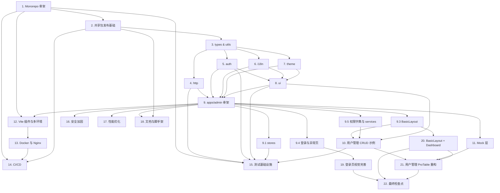

# Implementation Plan

## Overview

本任务清单基于 design.md 与 requirements.md 派生，按"地基 → 共享包 → 主应用框架 → 业务示例 → 工程化与部署 → 测试"的依赖顺序推进。

每个任务都映射到 requirements.md 中的具体条款，可独立验收。标注约定：

- `[PBT]`：需要使用 fast-check 编写属性测试的任务
- 子任务编号 `X.Y` 形式与父任务一一对应
- 末尾的 `_Requirements: ..._` 行声明该任务对应的 EARS 条款

执行建议：

- 优先完成第 1、2 节，把仓库与共享包发布机制跑通
- 第 3~8 节按依赖关系串行：types/utils → http → auth → i18n → theme → ui
- 第 9 节起以并行方式推进：主应用骨架、Mock、Vite 工程化、Docker/CI/CD 可分给不同成员
- 测试基础设施（第 15 节）建议在 4、5、8、9 节实现的同时穿插补齐 PBT，避免后期堆积

## Tasks

- [x] 1. 搭建 Monorepo 基础骨架与工具链
  - 创建 `pnpm-workspace.yaml`、`turbo.json`、`tsconfig.base.json`、`.npmrc`、`.editorconfig`、根级 `package.json` 与脚本编排
  - 在根目录配置 Husky + lint-staged + Commitlint，绑定 `pre-commit`、`commit-msg` hook
  - 在 `packages/eslint-config` 沉淀统一 ESLint / Prettier / TS 配置并导出 `index.js` / `react.js` / `node.js`
  - _Requirements: 1.1, 1.2, 1.3, 1.5, 16.1, 16.2, 16.3, 16.4_

- [x] 1.1 验证 Turborepo 任务编排
  - 运行 `pnpm turbo run lint typecheck test build` 并校验顺序
  - 在 CI 中加入 turbo 缓存命中率断言
  - _Requirements: 1.3, 14.5_

- [x] 1.2 [PBT] 包间依赖图无环属性测试
  - 用 fast-check 随机生成包依赖图，断言"存在拓扑序"等价于"无环"，作为后续添加包时的验证基线
  - 在 CI 中以脚本形式扫描 `packages/*/package.json` 的实际 deps，断言不存在循环
  - _Requirements: 1.4_

- [x] 2. 搭建共享包发布基础设施
  - 在每个 `packages/*` 中提供统一 `package.json` 模板（type=module、exports、files、publishConfig、peerDeps）
  - 接入 `tsup` 输出 ESM + CJS + DTS 三形态，验证 `sideEffects: false` 与 tree-shaking
  - 接入 Changesets：`pnpm changeset` 流程、PR 校验、Version Packages Bot
  - _Requirements: 2.1, 2.2, 2.3, 2.4, 2.5, 2.6_

- [x] 2.1 跨包消费验证
  - 在仓库内通过 `tsconfig paths + workspace:*` 验证免 build 联调
  - 在仓库外用临时新仓库 `pnpm add @keel/<pkg>` 验证拉取与类型引用
  - _Requirements: 2.5, 2.6_

- [x] 3. 实现 `@keel/types` 与 `@keel/utils`
  - `@keel/types`：定义 `ApiEnvelope`、`UserInfo`、`MenuNode`、`Tenant`、`TabItem`、`PageResult` 等共享类型，无运行时代码
  - `@keel/utils`：实现 `storage`（适配器）、`logger`、`eventBus`、`debounce`、`stableHash` 等通用工具
  - _Requirements: 1.5, 2.6, 5.6_

- [x] 4. 实现 `@keel/http`：HTTP 工厂、拦截器、Token 管理、防重复提交
  - 实现 `createHttp(options)` 工厂返回 Axios 实例并装配请求/响应拦截器
  - 实现 `createTokenManager`：access/refresh 持久化、单飞刷新、等待队列、`onAuthExpired` 回调
  - 实现 `dedupe` 拦截器：基于指纹（method + url + sorted(params) + stableHash(body)）的去重，自动清理 map
  - 实现业务信封拦截器：`code===0` 解开 `data`，否则抛 `BizError(code, message, traceId)`
  - 实现 `Authorization` / `X-Tenant-Id` / `Accept-Language` 三头自动注入（强制注入，业务不可覆盖）
  - _Requirements: 5.1, 5.2, 5.3, 5.4, 5.5, 5.6, 5.7, 5.8, 5.9, 18.4_

- [x] 4.1 [PBT] Token 单飞刷新属性测试
  - fast-check 随机生成 N 个并发 401 请求，断言 `api.refresh` 调用次数 ≤ 1
  - 断言所有等待请求最终被同一次刷新结果 resolve 或同时 reject
  - _Requirements: 5.2, 5.3_

- [x] 4.2 [PBT] 信封透明属性测试
  - fast-check 随机生成 envelope，断言 `code===0` 时 `request<T>` 返回 `envelope.data`
  - 断言 `code !== 0` 时必抛 `BizError`，且错误对象包含原始 `code/message/traceId`
  - _Requirements: 5.4_

- [x] 4.3 [PBT] 防重复指纹去重属性测试
  - fast-check 随机生成请求集合：指纹两两不同时全部发出；存在相同指纹时仅一个发出，其余被 `CanceledError` 拒绝
  - 断言响应/错误后指纹 map 完全清空（无泄漏）
  - _Requirements: 5.6, 5.7_

- [x] 4.4 头注入与多环境单测
  - 例子化用例：mock 三类环境变量切换，断言 baseURL、tenant 头等正确
  - _Requirements: 5.8, 5.9_

- [x] 5. 实现 `@keel/auth`：权限机制（机制与数据严格解耦）
  - 实现 `createAuth(adapter)` 工厂，导出绑定 adapter 后的 `usePermission`、`Auth`、`AuthGuard`、`buildRoutes`
  - `usePermission().has(code, mode)`：支持单/数组、`every/some` 语义；无参时默认放行
  - `<Auth>` 组件：`code` 不持有时渲染 `fallback`（默认 null/隐藏）
  - `buildRoutes(menus, ctx)`：递归生成 React Router v6 RouteObject，含懒加载、AuthGuard 包裹、redirect 处理、hidden 节点保留路由
  - 适配器无 / null 时 `usePermission.has` 静默返回 false
  - 预留 `PermissionContext.predicate` 钩子用于 ABAC 扩展
  - _Requirements: 3.1, 3.3, 3.4, 3.5, 3.6, 4.2, 4.6, 4.7_

- [x] 5.1 [PBT] usePermission 语义属性测试
  - 单值：`has(c) ↔ permissions.has(c)`
  - 数组 + some：任一命中为真；数组 + every：全部命中为真；空数组退化为 true
  - 单调性：`P1 ⊆ P2 ⟹ ∀ c, has_{P1}(c) ⟹ has_{P2}(c)`
  - _Requirements: 3.4_

- [x] 5.2 [PBT] buildRoutes 权限闭包属性测试
  - fast-check 随机生成菜单森林（含 redirect、hidden、permissionCodes）与权限集合
  - 断言所有可达叶子节点要么 `permissionCodes` 为空，要么至少有一个码在 `userPermissions` 中
  - 断言静态兜底（`/login`、`/exception/403`、`/exception/404`、`*`）始终存在
  - 断言相同输入多次构建结构等价（确定性）
  - _Requirements: 3.5, 4.2, 4.6, 4.7, 4.8_

- [x] 6. 实现 `@keel/i18n`：国际化工厂与公共词条
  - 实现 `createI18n` 工厂、`I18nProvider`、`useT(namespace)` Hook
  - 装配 `i18next-http-backend` + `i18next-browser-languagedetector`，检测顺序：query > localStorage > navigator
  - 提供 `common` 公共命名空间词条（按钮、表单校验、错误码、网络错误兜底）
  - 提供 `changeLanguage` 流程：i18next + dayjs + AntD ConfigProvider 同步切换
  - 离线兜底：HTTP 失败时回退到 localStorage 缓存
  - _Requirements: 8.1, 8.2, 8.3, 8.5, 8.6_

- [x] 6.1 命名空间懒加载验证
  - 例子化用例：模拟路由切换时 `loadNamespaces` 仅在进入新模块时被调用
  - _Requirements: 8.2_

- [x] 7. 实现 `@keel/theme`：类 iOS 主题
  - 导出 `tokens`、`darkTokens`、`themeConfig`，包含主色 #0A84FF、底色 #F2F2F7、圆角 12/16/20、毛玻璃、阴影、字体栈
  - 提供组件级 overrides（Button / Card / Modal / Table / Input / Menu / Tabs / Tag / Tooltip）
  - 提供全局样式片段（Header / Modal Mask 毛玻璃、卡片阴影、滚动条），由主应用 import
  - 暗色模式：`theme.algorithm = darkAlgorithm` + `darkTokens`，运行时切换不刷新页面
  - _Requirements: 9.1, 9.2, 9.3, 9.4, 9.5, 9.6_

- [x] 8. 实现 `@keel/ui`：业务组件薄封装
  - `PageContainer`：注入面包屑、标题、tab 状态
  - `SearchForm`：基于 ProForm 的查询表单封装
  - `KeelTable`：基于 ProTable 的表格封装，注入主题、i18n、列权限过滤、默认能力强制开启（分页/密度/刷新/列设置）
  - `KeelForm` / `KeelDescriptions` / `KeelCard`：基于 pro-components 的薄封装
  - `Auth` 组件 re-export 自 `@keel/auth`（避免业务侧重复 createAuth）
  - _Requirements: 10.1, 10.2, 10.3, 10.4, 10.5_

- [x] 8.1 [PBT] KeelTable 列权限过滤属性测试
  - fast-check 随机生成列定义（含/不含 `permission`）与权限集合
  - 断言：列 `permission` 不存在时必渲染；存在时当且仅当权限命中时渲染
  - _Requirements: 10.2_

- [x] 9. 搭建 `apps/admin` 主应用骨架
  - 初始化 Vite + React 18 + TS 工程，引入 `@keel/*` 全部 workspace 依赖
  - 创建 `app/providers.tsx`：装配 ConfigProvider（注入 themeConfig）+ AntdApp + I18nProvider + 全局 ErrorBoundary
  - 创建 `app/bootstrap.ts`：恢复 token、拉取 user/menus/permissions、写入 stores、调用 buildRoutes 生成路由表
  - 创建 `main.tsx`：调用 bootstrap、createBrowserRouter、render 根节点
  - 创建 `auth.ts`：调用 `createAuth(adapter)` 注入 userStore selector，导出业务侧 `usePermission/Auth/AuthGuard/buildRoutes`
  - _Requirements: 4.1, 4.2, 4.5, 17.1, 18.1_

- [x] 9.1 实现 Zustand stores
  - `userStore`：userInfo / menus / permissions(Set) / roles，含 `setUser/setMenus/setPermissions/reset`
  - `tenantStore`：current / list / `switchTenant(id)`（重新拉取菜单与权限并重建路由）
  - `appStore`：collapsed / theme / locale / tabs，含切换方法；通过 persist 中间件持久化「折叠态/主题/语言」（tabs 不持久化）
  - 业务示例 store：`stores/modules/order.store.ts`
  - _Requirements: 4.5, 6.1, 6.2, 6.3, 6.4, 6.5, 6.6_

- [x] 9.2 [PBT] reset 幂等属性测试
  - fast-check 随机生成 store 状态，断言 `reset^n(state) === reset(state)`，n ≥ 1
  - _Requirements: 6.3_

- [x] 9.3 实现 BasicLayout 与多页签
  - `BasicLayout`：Sider（菜单树）+ Header（用户菜单/租户切换/语言/主题）+ Breadcrumb + Tabs + Outlet
  - 路由变化监听：自动维护 tabs 栈，`affix:true` 不可关闭
  - 语言切换：菜单/Breadcrumb/Tabs 标题同步刷新
  - 主题切换：通过 ConfigProvider 即时切换无刷新
  - _Requirements: 7.1, 7.2, 7.3, 7.4, 7.5, 7.6_

- [x] 9.4 实现登录页与异常页
  - `pages/login`：表单 + 提交 → 调 `/auth/login` → setTokens → 拉用户/菜单/权限 → 跳转首页
  - `pages/exception/403` 与 `pages/exception/404`
  - `pages/_async.ts`：基于 `import.meta.glob('/src/pages/**/*.tsx')` 的懒加载工厂
  - _Requirements: 4.1, 4.3, 4.8, 17.3_

- [x] 9.5 实现业务权限字典与 services
  - `apps/admin/src/config/permissions.ts`：业务权限码常量字典（PERMISSIONS.ORDER.* 等）
  - `services/auth.service.ts` / `user.service.ts` / `menu.service.ts` / `order.service.ts`
  - _Requirements: 3.2, 4.1, 5.4_

- [x] 10. 实现典型 CRUD 示例：用户管理
  - `pages/system/user/index.tsx`：搜索表单 + KeelTable + 分页 + 列设置 + 新建/编辑/删除按钮
  - 各操作按钮被 `<Auth code="user:xxx" />` 包裹
  - 演示 `useTable` Hook、stale-while-revalidate 缓存
  - _Requirements: 4.4, 10.1, 10.2, 19.3, 20.1, 20.2, 20.3_

- [x] 11. 配置 Mock 层
  - 实现 `mock/_utils.ts` 的 `wrap()` 工具强制信封化
  - 实现 `auth.ts`、`user.ts`、`menu.ts`、`order.ts` 全套 mock，1:1 复刻信封
  - 通过 `VITE_USE_MOCK` 环境变量开关；生产构建禁用
  - 在 CI 中加入 mock schema 校验
  - _Requirements: 11.1, 11.2, 11.3, 11.4, 11.5_

- [x] 12. 配置 Vite 插件体系与多环境
  - 装配 `@vitejs/plugin-react`、`vite-plugin-mock`、`vite-plugin-checker`、`vite-plugin-svg-icons`、`vite-plugin-compression`、`rollup-plugin-visualizer`
  - 自研 `tooling/vite-plugins/env-validator`：启动期校验必填 VITE_ 变量，缺失时**先打印列表再中断**
  - 自研 `tooling/vite-plugins/build-info`：注入版本/commit/build time 到 `window.__BUILD_INFO__`
  - 配置 4 份 `.env.{,development,staging,production}` 与 `manualChunks`（react / antd / pro-components / zustand / business）
  - _Requirements: 12.1, 12.2, 12.3, 12.4, 12.5_

- [x] 12.1 单 chunk gzip 大小验证
  - 例子化：构建后扫描 dist，断言 gzip 后任意 chunk < 250KB
  - _Requirements: 19.4_

- [x] 13. Docker 与 Nginx 部署配置
  - 编写 `docker/Dockerfile`：多阶段（node:20-alpine + pnpm 构建 → nginx:1.27-alpine 运行）
  - 编写 `docker/nginx.conf`：gzip、SPA fallback、安全头、`/assets/` 长缓存、`index.html` 不缓存、`/health` 端点、HEALTHCHECK 指令
  - 编写 `docker/docker-compose.yml`：本地一键起 admin + mock-api
  - 通过 `docker buildx` 输出 amd64 + arm64 双架构镜像
  - _Requirements: 13.1, 13.2, 13.3, 13.4, 13.5, 13.6_

- [x] 14. CI/CD 流水线
  - `.github/workflows/ci.yml`：install / lint / typecheck / unit / build，使用 pnpm + turbo 缓存
  - `.github/workflows/e2e.yml`：安装 Playwright 浏览器、跑 E2E、失败时上传 trace **与** HTML 报告（两者必须同时上传）
  - `.github/workflows/release.yml`：tag 触发，复用 build artifact，docker buildx 推送多架构镜像
  - 接入 Changesets Action：合并 Version PR 后自动 `pnpm release` 发布 `@keel/*`
  - _Requirements: 14.1, 14.2, 14.3, 14.4, 14.5, 14.6, 15.4_

- [x] 15. 测试基础设施
  - 安装 Vitest + @testing-library/react + jsdom，配置 coverage 阈值（行 ≥80%、关键分支 ≥90%）
  - 安装 fast-check 并把 4.1/4.2/4.3/5.1/5.2/8.1/9.2 等 PBT 任务接入
  - 安装 Playwright，编写：登录成功/失败、Token 过期自动刷新、用户管理 CRUD、按钮级权限可见性、租户切换刷新菜单
  - _Requirements: 15.1, 15.2, 15.3, 15.4, 15.5, 20.4_

- [x] 16. 安全与加固
  - 实现 Token 存储适配器（localStorage/sessionStorage/memory），由 `VITE_AUTH_STORAGE` 切换
  - 引入 DOMPurify 用于富文本清洗，并在 ESLint 规则中禁止裸 `dangerouslySetInnerHTML`
  - 在请求拦截器读取 `csrf-token` cookie 并写入请求头
  - CI 加入 `npm audit --omit=dev`
  - _Requirements: 18.1, 18.2, 18.3, 18.4, 18.5_

- [x] 17. 性能优化
  - 路由懒加载 + Suspense + LoadingPlaceholder
  - 表格 >200 行强制虚拟滚动（不可关闭）
  - 实现 `useRequest` 的 stale-while-revalidate 缓存
  - 主题切换走 AntD 5 运行时 token，不重复打包 less
  - _Requirements: 19.1, 19.2, 19.3, 19.5_

- [x] 18. 文档与脚手架
  - 主应用 README：快速开始、目录速查、二次开发指南
  - 各 `packages/*` README：API、用法、Changelog 摘要
  - 预留 `tooling/scripts/create-app`：fork apps/admin 骨架的脚本接口
  - _Requirements: 1.2, 2.5_

- [x] 19. 登录页视觉完善
  - [x] 19.1 实现品牌 Logo 区与整体布局结构
    - 在 `pages/login/index.tsx` 顶部添加 Logo 容器（高度 80px），渲染占位 SVG 图标（高度 48px）与系统名称"Keel Admin"，水平居中对齐
    - 背景层：根元素设置 `min-height: 100vh`，背景 `linear-gradient(135deg, rgba(10,132,255,0.08), rgba(94,200,250,0.06))`，铺满 `100vw × 100vh`
    - _Requirements: 21.1, 21.7_

  - [x] 19.2 实现毛玻璃卡片与响应式宽度
    - 登录卡片 `Card` 设置 `bordered={false}`、`borderRadius ≥ 16px`、`backdrop-filter: blur(20px) saturate(180%)`
    - 卡片宽度：视口 ≥ 768px 时固定 400px，< 768px 时 `calc(100vw - 32px)`
    - _Requirements: 21.8_

  - [x] 19.3 实现完整表单元素与交互逻辑
    - 用户名输入框（前缀 `UserOutlined`）、密码输入框（前缀 `LockOutlined`，type="password"）、"记住我"Checkbox、"登录"Button 四个核心元素
    - 空值提交校验：字段为空时展示内联错误文案，不发起请求
    - Enter 键提交：密码输入框 `onPressEnter` 触发与点击按钮完全相同的提交逻辑
    - loading 状态：请求进行中按钮显示旋转图标，整个表单（所有输入框、Checkbox、Button）设置 `disabled={true}`
    - _Requirements: 21.2, 21.3, 21.4, 21.9_

  - [x] 19.4 实现登录成功/失败处理与重定向
    - 登录失败：表单上方展示 AntD `Alert`（type="error"），文案优先取后端 `message`，回退 i18n 键 `auth.login.error`；下次提交时清除 Alert
    - 登录成功：`navigate(target, { replace: true })`，target 优先取 `?redirect` query 参数（仅接受 `/` 开头的相对路径），回退到 `/`
    - _Requirements: 21.5, 21.6_

  - [x] 19.5 实现"记住我"localStorage 持久化
    - 勾选"记住我"并登录成功后，以键名 `keel_remembered_username`（过期 30 天）写入 localStorage
    - 页面初始化时读取该键，预填用户名并勾选 Checkbox
    - _Requirements: 21.10_

  - [x] 19.6 移动端适配
    - 视口 < 768px 时保持单列布局
    - 所有可交互元素 touch target 高度 ≥ 44px、宽度 ≥ 44px，相邻元素垂直间距 ≥ 8px
    - _Requirements: 21.11_

- [x] 20. BasicLayout 首页框架完善（含 Dashboard 页）
  - [x] 20.1 完善 Sider 响应式折叠与过渡动效
    - Sider 宽度 240px，折叠后 80px，CSS `transition: width 200ms ease`（不超过 300ms）
    - 折叠按钮点击：触发过渡并同步 `appStore.collapsed` 取反
    - 视口首次低于 1024px 时自动 `collapsed: true`，重新超过 1024px 时恢复折叠前状态
    - `userStore.menus` 为空时 Sider 菜单区渲染"暂无菜单"（zh-CN）/ "No menu"（en-US）占位提示，不抛出异常
    - _Requirements: 22.1, 22.2, 22.3, 22.13_

  - [x] 20.2 完善 Header 右侧操作区
    - 从左到右依次渲染：租户切换 Dropdown（仅当 `tenantStore.list.length > 0` 时显示）、语言切换 Dropdown（zh-CN / en-US）、明暗主题切换 Button、用户 Dropdown（展示 `userInfo.displayName`，含"个人信息"与"退出登录"）
    - _Requirements: 22.7_

  - [x] 20.3 完善退出登录流程
    - 依次执行：调用 `authService.logout()`（失败时不阻断）→ 所有 store `reset()` → `tokenManager.clear()` → `navigate('/login', { replace: true })`
    - _Requirements: 22.8_

  - [x] 20.4 完善 Breadcrumb 动态更新
    - 路由路径变化时，在 200ms 内基于 `userStore.menus` 树解析祖先链，根节点为首页，格式"一级菜单 / 二级菜单"
    - 路由不在菜单树中时，仅显示首页节点
    - _Requirements: 22.4_

  - [x] 20.5 完善 Tabs Bar 页签管理
    - 首次访问新路由：在末尾追加页签并激活；路由已存在时直接激活，不追加重复项
    - `affix: true` 的页签不渲染关闭按钮；关闭普通页签后优先激活右侧相邻页签，否则激活左侧，若 Tabs 为空则跳转 `/`
    - _Requirements: 22.5, 22.6_

  - [x] 20.6 实现 Dashboard 页
    - 路由 `/dashboard`：渲染欢迎标题（zh-CN：`你好，{displayName}！`，en-US：`Hello, {displayName}!`）与当前日期（zh-CN：`YYYY年MM月DD日`，en-US：`MMMM D, YYYY`），使用 `PageContainer` 包裹
    - 统计卡片区：恰好 4 张卡片（今日用户数、在线租户数、待处理工单数、系统状态），数据由前端静态 Mock 提供，每张卡片 `borderRadius ≥ 16px`、`boxShadow: 0 2px 8px rgba(0,0,0,0.06)`、`bordered={false}`
    - _Requirements: 22.9, 22.10_

  - [x] 20.7 确保语言/主题平滑切换与内容区滚动行为
    - 语言切换：Sider 菜单、Header 控件、Breadcrumb、Tabs 标题在同一 React 更新批次内同步更新，不刷页面
    - 主题切换：ConfigProvider `theme` prop 在同一渲染周期更新，BasicLayout 及子组件 100ms 内完成重绘，不触发 `window.location.reload()`
    - 内容区 `overflow: auto`，Sider（sticky）与 Header（`position: sticky, top: 0`）不随内容区滚动
    - _Requirements: 22.11, 22.12, 22.14_

- [x] 21. 用户管理 CRUD 页面 Pro-Components 重构
  - [x] 21.1 用 ProTable 替换现有用户列表
    - 将 `pages/system/user/index.tsx` 的列表重构为 `ProTable<UserInfo>`，数据加载通过 `request` prop 直接驱动，返回类型 `{ data: UserInfo[]; success: boolean; total: number }`，不使用 `useTable` hook
    - 默认列：username、displayName、email（挂 `permission: 'user:list'`）、roles（Tag 列表）、操作列（编辑/删除按钮）
    - 工具栏强制开启：`setting: true`、`reload: true`、`density: true`、`fullScreen: true`（不可禁用）
    - _Requirements: 23.1, 23.2, 23.10, 23.13_

  - [x] 21.2 实现 ProTable 搜索表单与分页
    - 搜索区字段：`keyword`（字符串，模糊匹配）与 `status`（枚举 `'active' | 'disabled' | undefined`），透传给 `userService.list` 查询参数
    - 分页：`defaultPageSize: 10`，分页器左侧展示总记录数（zh-CN：`共 N 条`，en-US：`Total N items`）
    - 重置按钮：清空 `keyword`/`status` 为 `undefined`，以 `{ current: 1, pageSize: 10 }` 重新调用
    - _Requirements: 23.3, 23.4, 23.14_

  - [x] 21.3 实现新建用户 Modal（ProForm）
    - "新建用户"按钮被 `<Auth code="user:create">` 包裹，持有权限时点击打开 `Create_Modal`
    - 表单字段：用户名（必填，maxLength 64，重复时字段下方提示"用户名已存在"）、显示名（必填，maxLength 64）、邮箱（选填，email 格式校验）、初始密码（必填，minLength 6，maxLength 128）、角色（多选，admin / editor / viewer）
    - 提交成功：关闭 Modal、刷新列表、`message.success`（zh-CN：`操作成功`，en-US：`Success`）
    - 提交失败：保持 Modal 打开，在 Form 顶部通过 Alert（type="error"）展示 `BizError.message`，回退 i18n 键 `common.error.unknown`
    - _Requirements: 23.5, 23.7_

  - [x] 21.4 实现编辑用户 Modal（ProForm）
    - 编辑按钮被 `<Auth code="user:update">` 包裹，点击打开预填当前行数据的 ProForm
    - 用户名字段 `disabled={true}` 不可修改，密码字段不渲染，其余字段（显示名、邮箱、角色）可编辑
    - 成功/失败处理同新建 Modal
    - _Requirements: 23.6, 23.7_

  - [x] 21.5 实现删除用户 Popconfirm
    - 删除按钮被 `<Auth code="user:delete">` 包裹，点击弹出二次确认
    - 确认文案 zh-CN：`确定删除用户 "{displayName}" 吗？`，确认后调用 `userService.remove(id)`，成功后刷新表格并展示 `message.success`
    - _Requirements: 23.8_

  - [x] 21.6 确保权限守卫与列权限过滤
    - 无权限时新建/编辑/删除按钮从 DOM 中移除（不渲染），不影响其他元素布局
    - email 列通过 `filterColumnsByPermission` 过滤（不持有 `user:list` 时移除该列）
    - _Requirements: 23.9, 23.10_

  - [x] 21.7 补全 Mock Handler 支持完整 CRUD
    - 在 `mock/user.ts` 中确保以下 handler 存在且正确信封化：GET `/api/users`（支持 keyword/status/分页参数）、POST `/api/users`、PUT `/api/users/:id`、DELETE `/api/users/:id`
    - _Requirements: 23.11_

  - [x] 21.8 验证 pro-components 依赖缺失时构建中断行为
    - 在 env-validator 或 vite.config.ts 中添加检测：若 `@ant-design/pro-components` 解析失败，输出包含安装命令 `pnpm add @ant-design/pro-components --filter @keel/admin` 的错误信息并中断构建
    - _Requirements: 23.12_

- [x] 22. 最终检查点：新增需求全面验收
  - 在 mock 模式下完整走通登录页（含"记住我"、移动端、Enter 提交、重定向）
  - 在 mock 模式下完整走通 BasicLayout（折叠动效、Dashboard 页、语言/主题切换、Tabs/Breadcrumb 联动）
  - 在 mock 模式下完整走通用户管理 ProTable CRUD（搜索、分页、新建、编辑、删除、权限列过滤）
  - 确保 Requirements 21、22、23 对应的单元测试与 E2E 用例全部通过

## Task Dependency Graph

下图描述任务之间的强制依赖关系（"A → B" 表示 A 必须先完成）。无连线的任务可并行推进。

```json
{
  "waves": [
    {
      "wave": 1,
      "description": "仓库地基与共享发布机制",
      "tasks": ["1", "1.1", "1.2", "2", "2.1"]
    },
    {
      "wave": 2,
      "description": "共享类型与工具",
      "tasks": ["3"]
    },
    {
      "wave": 3,
      "description": "核心共享包并行实现（依赖 wave 2）",
      "tasks": ["4", "4.1", "4.2", "4.3", "4.4", "5", "5.1", "5.2", "6", "6.1", "7"]
    },
    {
      "wave": 4,
      "description": "UI 业务组件（依赖 5/6/7）",
      "tasks": ["8", "8.1"]
    },
    {
      "wave": 5,
      "description": "主应用骨架与基础页面（依赖 4/5/6/7/8）",
      "tasks": ["9", "9.1", "9.2", "9.3", "9.4", "9.5"]
    },
    {
      "wave": 6,
      "description": "业务示例与基础设施（依赖 wave 5）",
      "tasks": ["10", "11", "12", "12.1", "16", "17", "18"]
    },
    {
      "wave": 7,
      "description": "部署与流水线（依赖 wave 6）",
      "tasks": ["13", "14"]
    },
    {
      "wave": 8,
      "description": "测试基础设施（贯穿，最终收口）",
      "tasks": ["15"]
    },
    {
      "wave": 9,
      "description": "登录页视觉完善 - 布局与样式（依赖 9.4）",
      "tasks": ["19.1", "19.2"]
    },
    {
      "wave": 10,
      "description": "登录页交互逻辑 + BasicLayout 框架完善（依赖 wave 9 / 9.3）",
      "tasks": ["19.3", "19.4", "19.5", "19.6", "20.1", "20.2", "20.3", "20.4", "20.5"]
    },
    {
      "wave": 11,
      "description": "Dashboard 页与平滑切换（依赖 20.1–20.5）",
      "tasks": ["20.6", "20.7"]
    },
    {
      "wave": 12,
      "description": "用户管理 ProTable 重构基础（依赖 wave 11 + 任务 10/11）",
      "tasks": ["21.1", "21.2", "21.8"]
    },
    {
      "wave": 13,
      "description": "用户管理 Modal、删除、权限守卫（依赖 21.1）",
      "tasks": ["21.3", "21.4", "21.5", "21.6", "21.7"]
    },
    {
      "wave": 14,
      "description": "最终检查点（依赖所有新增任务）",
      "tasks": ["22"]
    }
  ]
}
```



**关键路径**（最长依赖链，决定整体交付时间）：

`1 → 2 → 3 → {4, 5, 6, 7} → 8 → 9 → 9.3/9.5 → 10 → 21 → 22`

**可并行批次**：

- Batch A（依赖 T3）：T4、T5、T6、T7 可同时推进
- Batch B（依赖 T9）：T11、T16、T17、T18 可同时推进
- Batch C（依赖 T9.5 / T8）：T10 与 T15 内部 PBT 可穿插
- Batch D（依赖 T1）：T12、T14 可与共享包工作并行（不阻塞主线）
- Batch E（依赖 T9.4 / T9.3）：T19 与 T20 可并行推进
- Batch F（依赖 T19 / T20 / T21）：T22 为统一验收门禁

## Notes

### 验收策略

- 每个父任务（顶级编号）完成时，需对应跑通其所有子任务
- 标 `[PBT]` 的任务必须使用 fast-check 验证（不能用例子化测试替代，对应 Requirement 15.2）
- 所有任务在 PR 合并前必须通过 CI 五大阶段：lint / typecheck / unit / build / e2e

### 风险点

- **共享包发布权限**：在执行任务 2 前需要预先配置好私有 Registry（GHCR 或 Verdaccio）与 token 注入到 GitHub Secrets，否则 Changesets 自动发布会失败
- **Pro-Components 主题嫁接**：任务 8 的视觉一致性依赖任务 7 的 token 设计，建议先完成 7 再启动 8
- **E2E 稳定性**：任务 15 的 Playwright 用例需要 mock 层（任务 11）作为前置条件，避免依赖真实后端导致 CI flaky
- **Monorepo 类型路径解析**：任务 1 的 `tsconfig paths` 配置错误会导致 IDE 与构建解析不一致，需在 1.1 阶段验证
- **毛玻璃兼容性**：`backdrop-filter` 在部分旧版 Chrome/Safari 需前缀，建议在 19.2 验证 cross-browser

### 与 Design 的对照

- 共享包结构：design.md 的 "Shared Packages" 章节
- 权限机制 vs 数据：design.md 的 "关于 `@keel/auth` 的边界" 章节
- 类 iOS 主题：design.md 的 "类 iOS 主题（抛弃 AntD 默认风格）" 章节
- Docker 与 CI/CD：design.md 的 "Docker 部署与 CI/CD" 章节
- 关键算法：design.md 的 "Algorithmic Pseudocode" 章节（Bootstrap、buildRoutes、单飞刷新、防重复、信封拦截）

### 测试命令约定

- 单测：`pnpm turbo run test`（CI 默认 `--run` 模式）
- PBT 单独跑：`pnpm --filter @keel/<pkg> test --run path/to/*.pbt.test.ts`
- E2E：`pnpm --filter @keel/admin exec playwright test`
- 构建大小检查：`pnpm --filter @keel/admin run build && node tooling/scripts/check-chunk-size.mjs`

### 后续可选增强（不在当前 spec 范围）

- WebSocket 实时通道封装（消息中心、推送）
- 离线 PWA / Service Worker 缓存
- Feature Flag / 灰度开关基础设施
- 大文件分片上传组件
- 监控埋点 SDK 统一接入
